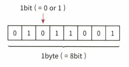

# 코어 자바스크립트

자바스크립트의 핵심 개념을 정확히 이해하기

[예제코드](https://github.com/wikibook/corejs)

## 데이터 타입 종류

JS는 데이터를 어떻게 처리하냐?


- 복사 동작 (기본형 vs 참조형)
    - 둘다 주솟값을 복사
    - 기본형 = 주솟값을 복사
    - 참조형 = 주솟값 묶음을 가리키는 주솟값을 복사


## 데이터 타입 배경 지식

### 메모리와 데이터


- 메모리에 데이터가 bit 형태로 저장된다
- 저장된 데이터는 메모리 주솟값을 통해 구분할 수 있다

### 식별자와 변수

- 변수(variable): 변할 수 있는 데이터
- 식별자(identifier): 변수명

## 변수 선언과 데이터 할당

### 변수 선언

```js
// 변수 선언
var a;
```

- 변할 수 있는 데이터라서 처음에는 `undefined`

### 데이터 할당

```js
// 변수 선언
var a;

// 데이터 할당
a = 'abc';
```


- JS는 숫자의 경우 8바이트를 확보하지만 문자열은 가변적
- 왜 변수 영역에 값을 직접 대입하지 않을까?
    - 데이터 변환을 자유롭게 + 메모리 효율적 관리
    - 데이터를 변수 영역에 중간에 두면 나중에 데이터 추가할 때 비효율적


- 반면 데이터 영역으로 빼두면 그냥 새로 만들고 가리키게 하면 되어서 효율적


## 기본형 데이터와 참조형 데이터

### 불변값

- 기본형 데이터는 불변값이다. (숫자, 문자열, boolean, null, undefined, symbol 등)
    - 데이터 영역은 바뀌지 않는다 (GC 당하면 사라지긴 함)

```js
var a = 'abc';
a = a + 'def';
```

- 'abc'의 뒤에 'def' 를 붙이지 않는다. 'abcdef' 가 만들어진다.
- 데이터 영역에 있으면 재활용하고 없으면 할당한다.


> 참고)  
> 변수 (variable) : 변수 영역 변경 가능  
> 상수 (constant) : 변수 영역 변경 불가


### 가변값

- 참조형 데이터
    - 기본적으로 가변값인데 설정에 따라 다름(`Object.freeze`)

```js
var obj1 = {
    a: 1,
    b: 'bbb'
};
```


- 객체의 변수(property) 영역이 별도로 존재한다. 근데 데이터 영역 가리키는 건 똑같다.
    - 기본형: `변수 -> 데이터`
    - 참조형: `변수 -> 변수 -> ... -> 데이터`


- 중첩 할당도 똑같다

```js
obj.arr = 'str';
```

- 위와 같이 `arr` 변수에 재할당을 해버리면 `데이터 영역 @5003` 은 자신을 참조하는 변수가 없게 된다.
    - 사실 데이터는 참조하는 변수의 개수를 세는데, 이걸 참조 카운트라고 한다.
    - 참조 카운트가 0이 되면 쓸데가 없으므로 GC가 자동으로 수집해버린다.


### 변수 복사 비교

```js
var a = 10;
var b = a; // a와 b가 같은 주소를 본다
var obj1 = { c:10, d: 'ddd'};
var obj2 = obj1; // obj2와 obj1이 같은 주소를 본다

b = 15; // 이제 b는 다른 주소를 본다
obj2.c = 20; // obj2는 여전히 obj1과 같은 주소를 본다

// a !== b
// obj1 === obj2
```


```js
var a = 10;
var b = a; // a와 b가 같은 주소를 본다
var obj1 = { c:10, d: 'ddd'};
var obj2 = obj1; // obj2와 obj1이 같은 주소를 본다

b = 15; // 이제 b는 다른 주소를 본다
obj2 = { c:20, d: 'ddd'}; // 이제 obj2는 다른 주소를 본다

// a !== b
// obj1 !== obj2
```


- 변수가 뭘 가리키고 있는지 생각하면 설명이 편하다
- C에서는 스택에 쌓는 실제 값이 있는데 JS는 진정한 의미의 값은 없는 듯
    - 정수를 재활용 ㄷㄷ 

## 불변 객체

### 불변 객체 만드는 법

- 함수형 프로그래밍 등에서 주요 기초 개념
    - 새로운 데이터를 할당하면 기존 데이터는 안 바뀐다
    - 그럼 매번 새로운 객체를 만들어 재할당하면 되는거 아니냐? 맞음
    - 그런 도구나 규칙을 쓰면 불변성 확보 가능 

- 불변 객체가 왜 필요하냐?
    - 참고하라고 원본 줄 때 실수로 원본이 바뀌는 걸 막고 싶음

```js
var copyObject = function(target) {
  var result = {};
  for (var prop in target) {
    result[prop] = target[prop];
  }
  return result;
};

var user = {
  name: 'Jaenam',
  gender: 'male',
};

var user2 = copyObject(user);
user2.name = 'Jung';

if (user !== user2) {
  console.log('유저 정보가 변경되었습니다.'); // 유저 정보가 변경되었습니다.
}
console.log(user.name, user2.name); // Jaenam Jung
console.log(user === user2); // false
```

- 위와 같이 `copyObject` 함수를 통해서만 `user` 객체를 복사하자는 규칙을 정하면 `user`는 불변 객체다
- 그런데 사람은 실수를 하니 시스템적 제약을 거는 게 맞다.
    - `immutable.js` 등

### 얇은 복사와 깊은 복사

- 얕은 복사: 바로 아래 단계만 복사
    - 위에서 본 `copyObject` 함수
- 깊은 복사: 내부 모든 값을 찾아서 복사

```js
var copyObjectDeep = function(target) {
  var result = {};
  if (typeof target === 'object' && target !== null) {
    for (var prop in target) {
      result[prop] = copyObjectDeep(target[prop]);
    }
  } else {
    result = target;
  }
  return result;
};
```

- 이렇게 재귀적으로 짜야 한다
    - target이 객체면 그 객체의 prorperty 대상으로 재귀 수행

> hasOwnProperty 메서드 쓰면 프로토타입 체이닝 통해 상속된 프로퍼티는 복사하지 않도록 막을 수 있다
> getter/setter 를 복사하는 방법은 Object.getOwnPropertyDescriptor 외에 마땅한 방법이 없다.


```js
var copyObjectViaJSON = function(target) {
  return JSON.parse(JSON.stringify(target));
};
var obj = {
  a: 1,
  b: {
    c: null,
    d: [1, 2],
    func1: function() {
      console.log(3);
    },
  },
  func2: function() {
    console.log(4);
  },
};
var obj2 = copyObjectViaJSON(obj);

obj2.a = 3;
obj2.b.c = 4;
obj.b.d[1] = 3;

console.log(obj); // { a: 1. b: { c: null, d: [1, 3], func1: f() }, func2: f() }
console.log(obj2); // { a: 3. b: { c: 4,    d: [1, 2] } }
```

- 사실 가장 단순한데 잘 먹히는 방식으로 JSON 문자열로 전환했다가 바꾸는 것
    - 순수한 데이터 저장용 객체에 잘 먹힘


## undefined와 null

- undefined
    - 값 대입한적 없음
    - 존재하지 않는 프로퍼티 접근
    - return 이 없거나 호출되지 않은 함수의 실행 결과
- null
    - 비어있음
    - `typeof null`이 object 인 건 JS 버그

```js
var arr1 = [undefined, 1];
var arr2 = [];
arr2[1] = 1;

arr1.forEach(function(v, i) {
  console.log(v, i);
}); // undefined 0 / 1 1
arr2.forEach(function(v, i) {
  console.log(v, i);
}); // 1 1

arr1.map(function(v, i) {
  return v + i;
}); // [NaN, 2]
arr2.map(function(v, i) {
  return v + i;
}); // [empty, 2]

arr1.filter(function(v) {
  return !v;
}); // [undefined]
arr2.filter(function(v) {
  return !v;
}); // []

arr1.reduce(function(p, c, i) {
  return p + c + i;
}, ''); // undefined011
arr2.reduce(function(p, c, i) {
  return p + c + i;
}, ''); // 11
```

- undefined는 JS 엔진이 반환하는 값
    - 직접 undefined 를 할당하면 변수가 데이터로서 undefined를 참조해버려서 동작이 바뀜
    - 그러지 말고 null 써라
