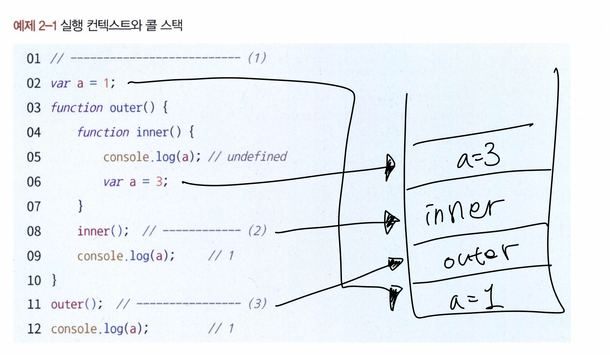

# Chapter 2. 실행 컨텍스트

## 1. 실행 컨텍스트란?

- 실행할 코드에 제공할 환경 정보를 모아놓은 객체
- 동일한 환경에 있는 코드들을 실행할 때 필요한 환경 정보들을 모아 컨텍스트를 구성하고, 이를 콜 스택에 쌓아올렸다가, 위부터 차례대로 실행하게 됨.
- 실행 컨텍스트를 구성할 수 있는 방법 : 전역공간, eval()함수, 함수



1.  전역 컨텍스트가 콜스택에 담김
    - 자바 스크립트 파일이 열리는 순간 전역 컨텍스트가 활성화됨
2. 순차적으로 수행
3. outer를 호출하면, outer에 대한 환경 정보를 수집. 실행 컨텍스트 생성하여 콜스택에 넣음
4. outer과 관련된 내부의 코드를 순차적으로 수행
5. 이후 스택에 쌓인 차례대로 수행

⇒ 한 실행 컨텍스트가 콜 스택의 맨 위에 쌓이는 순간이 곧 현재 실행할 코드에 관여하게 되는 시점.

- 어떤 실행 컨텍스트가 활성화될 때 자바스크립트 엔진은 해당 컨텍스트에 관련된 코드들을 실행하는데 필요한 환경 정보들을 수집해서 실행 컨텍스트 객체에 저장하게 됨.

### 실행 컨텍스트의 수집 정보

- VariableEnvironment
    - environmentRecord(Snapshot) - 현재 컨텍스트 식별자
    - outerEnvironmentReference (snapshot) - 외부 환경 변수
- LexicalEnvironment - 실시간 반영
    - environmentRecord
    - outerEnvironmentReference
- ThisBinding - this 식별자

## 2. VariableEnvironment

- LexicalEnvironment와 담기는 내용은 동일하지만, 최초 실행시의 스냅샷을 유지한다는 점이 다름 (초기 상태를 유지함)
- 실행 컨텍스트를 생성할 때 VariableEnvironment에 정보를 먼저 담은 다음, 이를 그대로 복사하여 LexicalEnvironment를 만듦.
- 이후에는 Lexical을 주로 활용하게됨

## 3. LexicalEnvironment

- ‘어휘적 환경’, ‘정적 환경’, ‘사전적인’
- “현재 컨텍스트의 내부에 어떤 식별자들이 있고 그 외부정보는 X를 참조하도록 구성돼있다”
- VariableEnvironment와 담기는 내용은 동일하지만, LexicalEnvironment는 실시간으로 변경사항이 반영된다는 점에서 차이가 있습니다.
- 실행 컨텍스트가 생성될 때 VariableEnvironment의 정보를 복사하여 만들어지며, 이후 코드의 실행 도중에 환경에 변화가 생기면 실시간으로 LexicalEnvironment에 반영됩니다.

### 1) environmentRecord와 호이스팅

- environmentRecord에는 현재 컨텍스트와 관련된 코드의 식별자 정보들이 저장됨.
- 컨텍스트 내부 전체를처음부터 끝까지 쭉 흝어나가며 순서대로 수집함
- 참고) 전역 실행 컨텍스트는 변수 객체를 생성하는 대신 전역 객체를 활용함. (ex : window, global 등)
    - 내장 객체가 아닌 호스트 객체로 분류됨 (호스트객체가 뭐지?)

### 호이스팅

- 끌어올리다 라는 의미. 코드 해석을 좀 더 수월하게 하기 위해 environmentRecord의 수집 과정을 추상화한 개념
- 코드가 실행되기 전에 자바 스크립트 엔진이 해당 환경에 속한 코드의 변수명들을 모두 알고 있게 되는 것.
- 식별자들을 최상단으로 끌어올려둔 다음 실행 컨텍스트를 수행함.
- EnvironmentRecord는 현재 실행될 컨텍스트의 대상 코드 내에 어떤 식별자들이 있는지에만 관심이 있음. 어떤 값이 할당될지는 노관심
    - 변수명만 끌어올리고 할당 과정은 원래 자리에 그대로 남겨둠
    - var x = 1; 이라는 과정이 있다면, var x;까지만 미리 수집한다는 의미
- 주의할점!
    - 변수는 선언부와 할당부를 나누어 선언부만 끌어올림
    - 함수 선언은 함수 전체를 끌어올림
    
    ⇒ 호이스팅이 끝나면, 함수 선언문은 함수명으로 선언한 변수에 함수를 할당한것처럼 여길수도 있음.
    

### 함수 선언문과 함수 표현식

- 함수 선언문
    - function 정의부만 존재하고 별도의 할당 명령이 없는 것
    - ex ) function a() {}
    - 반드시 함수명이 정의돼 있어야 함. (기명 함수 표현식)
- 함수 표현식
    - 정의한 function을 별도의 변수에 할당하는것
    - var b = function() {}
    - 함수명이 없어도 됨 (익명 함수 표현식)
- 참고사항
    - 기명 함수 표현식에서 함수명은 왜 필요한가?
        - 함수 내부에서 재귀함수를 호출하는 용도로도 쓸 수 있음.

```jsx
console.log(sum(1,2));
console.log(multiply(3,4));

// 함수 선언문
function sum (a,b) {
	return a+b;
}

// 함수 표현식
var multifly = function (a,b) {
	return a+b;
};
```

```jsx
// 함수 선언문
var sum = function sum (a,b) {
	return a+b;
}

var multiply;

console.log(sum(1,2));
console.log(multiply(3,4)); // 에러발생

// 함수 표현식
multifly = function (a,b) {
	return a+b;
};
```

- multiply의 경우 변수 선언쪽만 끌어올렸기 때문에, 함수의 내용을 몰라 에러가 발생함
- 선언한 후에야 호출할 수 있다

### 함수 선언문의 위험성

- 동일한 변수명에 서로 다른 값을 할당할 경우 나중에 할당한 값이 먼저 할당한 값을 덮어씌움 (overrride)
    
    ⇒ 맨 마지막에 할당된 값에 대해서만 실제로 호출됨
    
- 모든 함수가 함수 표현식으로 정의가 되어있어야, 이런 중복 선언과 같은 부분을 피할 수 있음

### 2) 스코프, 스코프 체인, outerEnvironmentReference

- 스코프란?
    - 식별자(변수)에 대한 유효범위
    - ex ) A의 외부에서 선언한 변수는 A의 외부뿐 아니라 A의 내부에서만 접근할 수 있음
    - ex2) A의 내부에서 선언한 변수는 오직 A의 내부에서만 접근할 수 있음
    - 오직 함수에 의해서만 생성
- 스코프 체인
    - ‘식별자의 유효범위’를 안에서부터 바깥으로 차례로 검색해나가는 것
        - 이를 가능하게 하는것이 outerEnvironmentReference
- outerEnvironmentReference
    - 현재 호출된 함수가 선언될 당시의 LexicalEnvironment를 참조함
    - 콜 스택상에서 어떤 실행 컨텍스트가 활성화된 상태일 때 실행
    - 연결 리스트의 형태를 띔 (A>B>C)
        - 가장 바깥에는 결국 전역 컨텍스트의 LexicalEnvironment가 존재함.
        - 무조건 스코프 체인 상에서 가장 먼저 발견된 식별자에만 접근 가능하게 됨
    
    
    


- 스코프 체인을 타고 접근 가능한 변수의 수는 늘어남
- 무조건 스코프 체인 상의 첫번째 인자 부터 검색하게 됨
    - 식별자가 존재하면 스코프 체인을 더 진행하지 않고 즉시 반환하게 됨.
    - 즉 전역공간에서 선언한 동일 이름의 변수가 함수 내부에 존재한다면 해당 전역변수에는 접근할 수 없게됨
        
        ⇒ **변수 은닉화**
        

### 전역변수와 지역변수

- 전역변수
    - 전역 스코프에서 선언한 변수와 함수
- 지역변수
    - 함수 내부에서 선언한 변수

⇒ 코드의 안정성을 위해 가급적 전역변수 사용을 최소화하고자 하는것이 좋음
