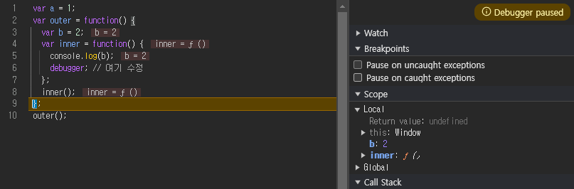

# 코어 자바스크립트

자바스크립트의 핵심 개념을 정확히 이해하기

[예제코드](https://github.com/wikibook/corejs)

## 실행 컨텍스트

### 실행 컨텍스트란?

실행할 코드에 제공할 환경 정보를 모아놓은 객체

- 콜 스택에 쌓아두었다가 가장 위에 있는 컨텍스트와 관련 있는 코드를 실행하는 식으로 전체 코드의 환경과 순서를 보장
- 실행 컨텍스트를 구성할 수 있는 방법
    - 전역공간
    - eval()
    - 함수


```js
// -------------------------- (1)
var a = 1;
function outer() {
  function inner() {
    console.log(a); // undefined
    var a = 3;
  }
  inner(); // ------------ (2)
  console.log(a); // 1
}
outer(); // ---------------- (3)
console.log(a); // 1
```
- 실행 컨텍스트의 생성 예시
    - (1) js 코드 실행과 동시에 전역 실행 컨텍스트 생성
    - (3) outer 함수 호출 시 실행 컨텍스트 생성
    - (2) inner 함수 호출 시 실행 컨텍스트 생성

- 실행 컨텍스트가 담는 정보
    - VariableEnvironment： 현재 컨텍스트 내의 식별자들에 대한 장보 + 외부 환경 정보. 선언 시점의 LexicalEnvironment의 스냅샷으로 변경 사항은 반영되지 않음.
    - LexicalEnvironment： 처음에는 VariableEnvironment와 같지만 **변경 사항이 실시간으로 반영**됨.
    - ThisBinding： this 식별자가 바라봐야 할 대상 객체.

콜 스택 위에서부터 컨텍스트를 실행한다.

### VariableEnvironment

VariableEnvironment 에서 최초 실행 시의 스냅샷을 유지한다. VariableEnvironment 를 복사해서 LexicalEnvironment 를 만들고 이후에는 LexicalEnvironment 를 사용한다.

### LexicalEnvironment

- 컨텍스트를 구성하는 환경 정보를 모아두는 사전 느낌으로 이해  

> 전역 실행 컨텍스트는 변수 객체를 생성하지 않고, JS 엔진이 제공하는 전역 객체를 활용한다.  
> 브라우저: window, Node.js: global // JS native object 아님, host object 맞음

- environmentRecord
  - 현재 컨텍스트와 관련된 코드의 식별자 정보들이 저장

- 호이스팅
    - 코드 해석을 수월하게 하기 위한 개념. 실행 컨텍스트 생성하면서 변수 선언부를 코드 최상단으로 끌어올려지는 것처럼 보이게 된다. (할당부는 코드 상 위치 그대로)
    - 함수 선언은 전체를 끌어올림 (브랜든 아이크가 쉬운 언어로 만들고 싶어해서 그랬음. 함수 선언 위치에 무관하게 사용할 수 있도록)


```js
// 원본
function a() {
  console.log(b); // (1)
  var b = 'bbb'; // 수집 대상 1(변수 선언)
  console.log(b); // (2)
  function b() {} // 수집 대상 2(함수 선언)
  console.log(b); // (3)
}
a();
```
```js
// 호이스팅 후
function a() {
  var b; // 수집 대상 1. 변수는 선언부만 끌어올립니다.
  function b() {} // 수집 대상 2. 함수 선언은 전체를 끌어올립니다.

  console.log(b); // (1)
  b = 'bbb'; // 변수의 할당부는 원래 자리에 남겨둡니다.
  console.log(b); // (2)
  console.log(b); // (3)
}
a();

// 함수 선언을 함수 표현식으로 변경 (해석 편)
function a() {
  var b;
  var b = function b() {}; // ← 바뀐 부분

  console.log(b); // (1)
  b = 'bbb';
  console.log(b); // (2)
  console.log(b); // (3)
}
a();
```


#### 함수 선언문과 함수 표현식
```js
function a() {
  /* ... */
} // 함수 선언문. 함수명 a가 곧 변수명.
a(); // 실행 OK.

var b = function() {
  /* ... */
}; // (익명) 함수 표현식. 변수명 b가 곧 함수명.
b(); // 실행 OK.

var c = function d() {
  /* ... */
}; // 기명 함수 표현식. 변수명은 c, 함수명은 d.
c(); // 실행 OK.
d(); // 에러!
```

> 참고) 기명 함수 표현식은 함수 외부에서는 사용할 수 없음. 변수에 할당 했으면 그걸로 함수 내부에서 호출하면 되는데 굳이 왜 필요할까? (var c = function d() { c(); } )  
> => 과거 브라우저에서 익명 함수의 이름을 제대로 출력하지 못 할 때 디버깅 편의를 위해서 사용 되었음.

```js
console.log(sum(1, 2));
console.log(multiply(3, 4));

function sum(a, b) {
  // 함수 선언문 sum
  return a + b;
}

var multiply = function(a, b) {
  // 함수 표현식 multiply
  return a * b;
};
```

```js
var sum = function sum(a, b) {
  // 함수 선언문은 전체를 호이스팅합니다.
  return a + b;
};
var multiply; // 변수는 선언부만 끌어올립니다.
console.log(sum(1, 2));
console.log(multiply(3, 4));

multiply = function(a, b) {
  // 변수의 할당부는 원래 자리에 남겨둡니다.
  return a * b;
};
```


- 선언문과 표현식은 호이스팅에서 차이가 꽤 난다
    - 선언문을 작성하면 해당 실행 컨텍스트 전체에 영향을 준다
    - 실수로 이미 존재하는 함수명으로 다시 선언해버리면 덮어써버림

```js
console.log(sum(3, 4)); // Uncaught Type Error: sum is not a function

var sum = function(x, y) {
  return x + y;
};

var a = sum(1, 2);

var sum = function(x, y) {
  return x + ' + ' + y + ' = ' + (x + y);
};

var c = sum(1, 2);
console.log(c);
```

#### 스코프, 스코프 체인, outerEnvironmentReference

- 스코프
    - 식별자에 대한 유효범위
    - 오직 함수에 의해서만 스코프 생성됨
- 스코프 체인
    - 스코프를 안에서 밖으로 검색해 나가는 것
    - 이걸 위한 게 `outerEnvironmentReference` 이다
        - 현재 호출된 함수가 선언될 **당시의** `LexicalEnvironment`를 참조한다.
        - 실행 컨텍스트는 연결리스트 꼴이 된다. 
        - 쭉 따라 올라가면 마지막에는 전역 컨텍스트의 `LexicalEnvironment`에 도달한다.
    - 여러 스코프에서 동일 식별자를 선언하면, 스코프 체인 상 가장 먼저 발견된 식별자에만 접근 가능하다

```js
var a = 1;
var outer = function() {
  var inner = function() {
    console.log(a);
    var a = 3;
  };
  inner();
  console.log(a);
};
outer();
console.log(a);
```


- L.E: LexicalEnvironment
- e: environmentRecord
- o: outerEnvironmentReference
- [숫자]: 코드 줄 번호를 의미

- 변수 은닉화 (variable shadowing)
    - inner 함수 내부에서 a 변수를 선언했기 때문에 전역 공간에서 선언한 동일한 이름의 a 변수에는 접근할 수 없음

#### 상위 스코프 정보 확인 방법 (크롬 브라우저)

```js
var a = 1;
var outer = function() {
  var b = 2;
  var inner = function() {
    console.log(b);
    console.dir(inner);
  };
  inner();
};
outer();
```


- `outer` 스코프의 식별자인 `b` 와 `inner` 를 확인할 수 있다.

#### 디버거 이용

```js
var a = 1;
var outer = function() {
  var b = 2;
  var inner = function() {
    console.log(b);
    debugger; // 여기 수정
  };
  inner();
};
outer();
```


- `outer` 스코프로 와서 Local 스코프를 확인하면 식별자인 `b` 와 `inner` 를 확인할 수 있다.


- `global` 스코프에서는 `outer` 식별자를 확인할 수 있다

- 전역 공간 (global 스코프) 에 함수/변수 선언하지 마라 (코드 수정 영향도 최소화)
    - 전역변수 사용 최소화 기법
        - 즉시실행함수, 네임스페이스, 모듈 패턴, 샌드박스 패턴
        - 모듈 관리도구 AMD, CommonJS, ES6

### this

- 실행 컨텍스트의 thisBinding 에는 this로 지정된 객체가 저장됨.
    - 지정 안 되어있으면 전역 객체
    - 함수 호출 방식에 따라 지정 대상이 다름 (3장에서 다룸)

### 정리

- **실행 컨텍스트**
    - 코드 실행에 필요한 환경 정보를 담은 객체.
    - **종류**
        - 전역 컨텍스트: 전역 코드 실행 시 자동 생성.
        - 함수 컨텍스트: 함수 호출 시 생성.
    - **구성 요소**
        - **VariableEnvironment**
            - 초기 상태 정보 보유.
            - 변경사항 반영하지 않음.
        - **LexicalEnvironment**
            - 실행 도중 변경사항 즉시 반영.
            - 구성: `environmentRecord`, `outerEnvironmentReference`.
- **호이스팅**
  - 코드 최상단으로 변수와 함수 선언 이동.
  - 선언은 호이스팅되지만 할당은 원 위치에 유지.
- **스코프**
  - 변수의 접근 가능 범위.
  - `outerEnvironmentReference`: 선언 위치의 LexicalEnvironment 참조.
- **변수**
  - 전역 변수: 전역 컨텍스트에 속함.
  - 지역 변수: 함수 컨텍스트에 속함.
- **this**
  - 컨텍스트 활성화 시 지정된 값.
  - 기본값: 전역 객체.
