# 3장

자바스크립트에서 this는 어디서든 사용할 수 있음
함수와 객체의 구분이 느슨한 자바스크립트에서 this는 이 둘을 구분하는 거의 유일한 기능이다.

## 3-1 상황에 따라 달라지는 this

this는 실행 컨텍스트가 생성될 때 함께 결정된다.
실행 컨텍스트는 함수를 호출할 때 생성되므로, this는 함수를 호출할 때 결정된다고 할 수 있다.

#### 3-1-1 전역 공간에서의 this

전역 공간에서 this는 전역 객체를 가리킨다.  
전역 컨텍스트를 생성하는 주체 : 전역 객체
전역 객체는 자바스크립트 런타임 환경에 따라 다른 이름과 정보를 가지고 있다.

- 브라우저환경 : window
- Node.js 환경 : global

전역 변수 = 전역 객체의 프로퍼티  
-> 자바스크립트의 모든 변수는 특정 객체의 프로퍼티로서 동작함

대부분의 경우에 var로 선언한 것과 windows.으로 프로퍼티에 직접할당한 것은 동일하게 동작함  
삭제 명령일 때는 다르게 동작함  
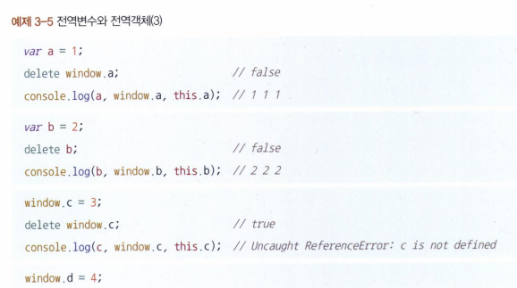
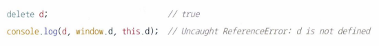  
전역변수로 선언한 경우에는 삭제가 되지 않음

**var로 선언한 전역변수와 전역객체의 프로퍼티는 호이스팅 여부 및 configurable 여부에서 차이가 나타남**

#### 3-1-2 메서드로서 호출할 때 그 메서드 내부에서의 this

어떤 함수를 실행하는 법

- 함수로서 호출
  - 그 자체로 독립적인 기능을 수행
- 메서드로서 호출
  - 자신을 호출한 대상 객체에 관한 동작을 수행

이 둘을 구분하는 유일한 차이는 **독립성**이다.  
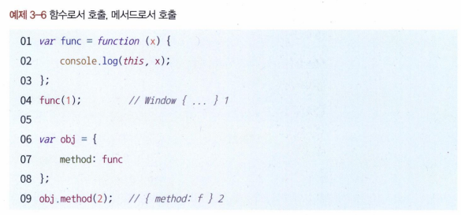  
원래의 익명함수는 그대로인데 이를 변수에 담아 호출한 경우와 obj 객체의 프로퍼티에 할당해서 호출한 경우에 this가 달라진다.

함수로서 호출과 메서드로서 호출을 구분하는 방법

- 함수 앞에 점이 있는지 여부로 구분
- 대괄호 표기법에 따른 경우도 포함

메서드 내부에서의 this  
메서드의 호출 주체 : 함수명 앞의 객체  
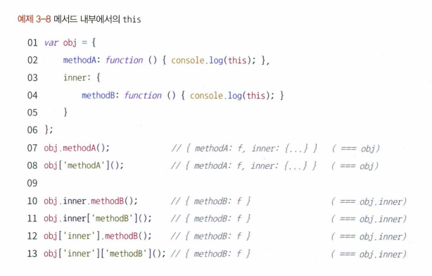

#### 3-1-3 함수로서 호출할 때 그 함수 내부에서의 this

함수 내부에서의 this  
어떤 함수를 함수로서 호출할 경우에는 this가 지정되지 않음  
실행 컨텍스트를 활성화할 당시에 this가 지정되지 않은 경우 this는 전역 객체를 바라봄, 따라서 함수에서의 this는 전역 객체를 가리킴

메서드 내부에서의 this
해당 함수를 호출하는 구문 앞에 점, 그 객체를 가르킴
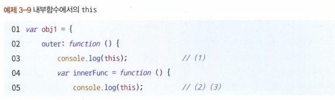
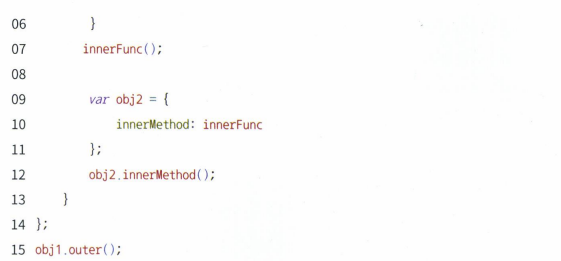

obj1, windows, obj2

#### 3-1-4 콜백 함수 호출 시 그 함수 내부에서의 this

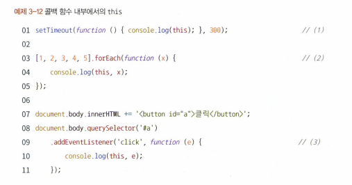

1. this 지정 X
2. this 지정 X
3. querySelector('#'a)

#### 3-1-5 생성자 함수 내부에서의 this

자바스크립트는 함수에 생성자로서의 역할을 함께 부여함  
new 명령어와 함께 함수를 호출하면 해당 함수가 생성자로서 동작하게됨  
어떤 함수가 생성자 함수로서 호출된 경우 내부에서의 this는 곧 새로 만들 구체적인 인스턴스 자신이 된다.

생성자의 prototype 프로퍼티를 참조하는 **proto**라는 프로퍼티가 있는 객체를 만들고, 미리 준비된 공통 속성 및 개성을 해당 객체에 부여함
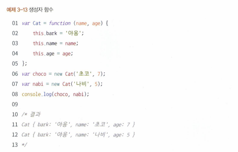

## 3-2 명시적으로 this를 바인딩하는 방법

#### 3-2-1 call 메서드

call 메서드는 메서드의 호출 주체인 함수를 즉시 실행하도록 하는 명령  
첫 번째 인자를 this로 바인딩, 이후 인자들을 호출할 함수의 매개변수

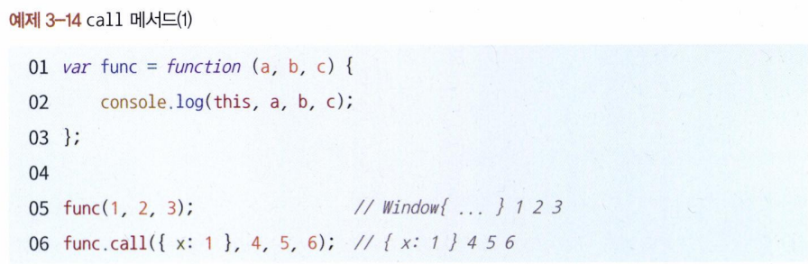
call 메서드를 통해 임의의 객체를 this로 지정할 수 있다.

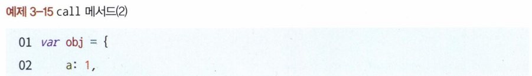
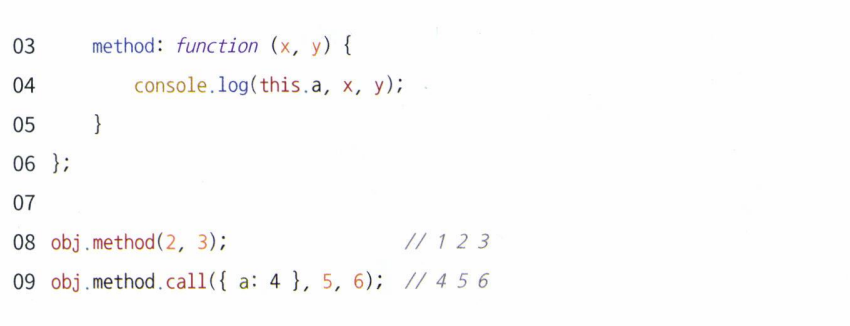

#### 3-2-2 apply 메서드

apply 메서드는 call 메서드와 기능적으로 완전히 동일함  
단, apply 메서드는 두 번째 인자인 함수의 매개변수를 배열로 받음
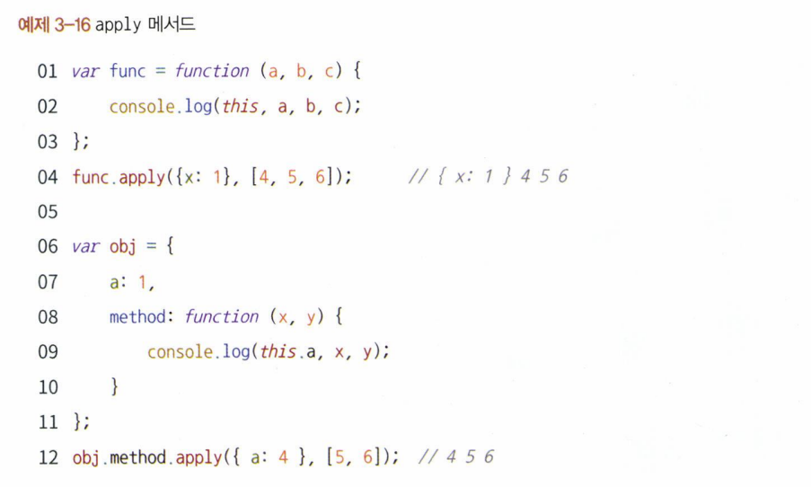

#### 3-2-3 call/apply 메서드의 활용

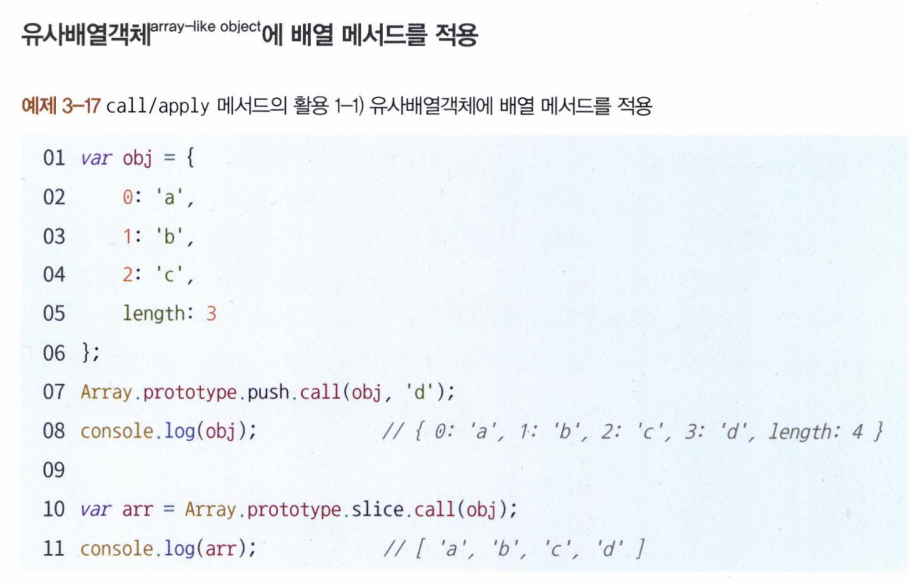
객체에는 배열 메서드를 직접 적용할 수 없지만, 키가 0 또는 양의 정수인 프로퍼티가 존재하고 length 프로퍼티의 값이 0 또는 양의 정수인 객체에서 call 또는 apply 메서드를 이용해 배열 메서드를 차용할 수 있다.

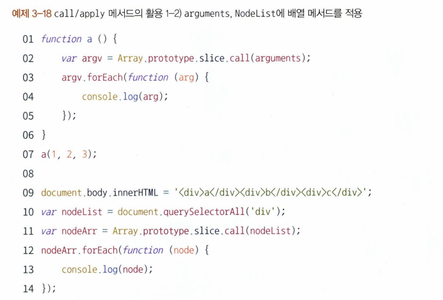
arguments 객체도 유사배열 객체이므로 위의 방법으로 배열로 전환해서 활용할 수 있다.  
querySelectorAll, getElementsByClassName 등의 Node 선택자도 동일한 결과

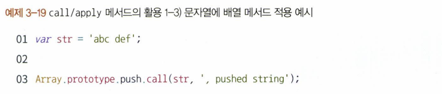
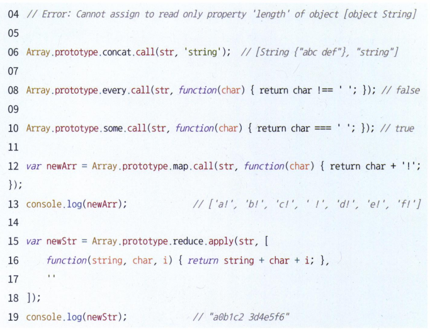

문자열도 유사배열객체여서 적용가능 함  
단, 문자열은 length가 읽기 전용 프로퍼티이기 때문에 원본 문자열을 변경하는 메서드(push, pop, shift, unshift, splice 등)은 에러를 던지며, concat처럼 대상이 반드시 배열이어야하는 경우에는 제대로 된 결과를 얻을 수 없다.  
위와 같은 방법은 의도를 파악하기 힘들고, ES6에서 Array.from을 도입함

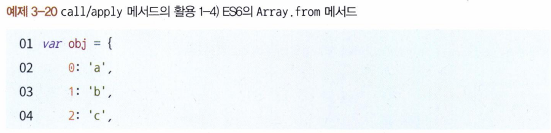
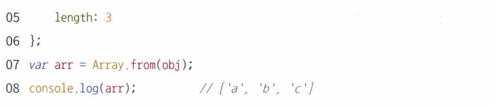

**생성자 내부에서 다른 생성자 호출**  
생성자 내부에 다른 생성자와 공통된 내용이 있을 경우 call 또는 apply를 이용해 다른 생성자를 호출하면 간단하게 반복을 줄일 수 있다.
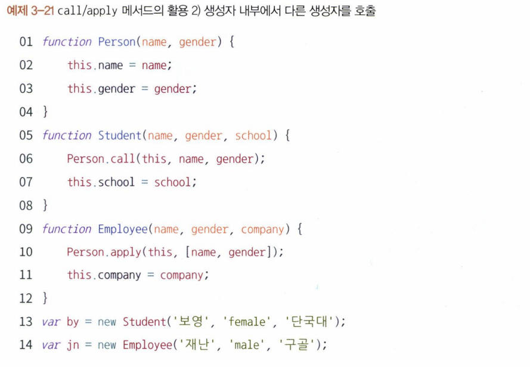

여러 인수를 묶어 하나의 배열로 전달하고 싶을 때 - apply 활용
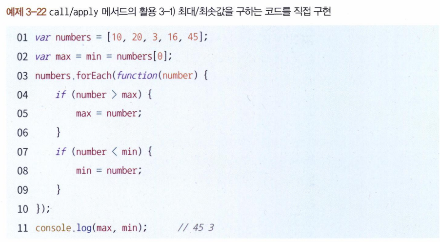
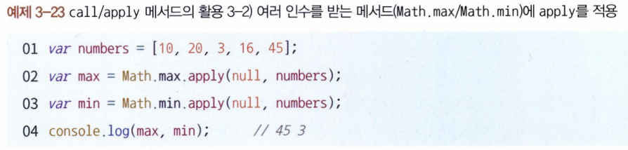
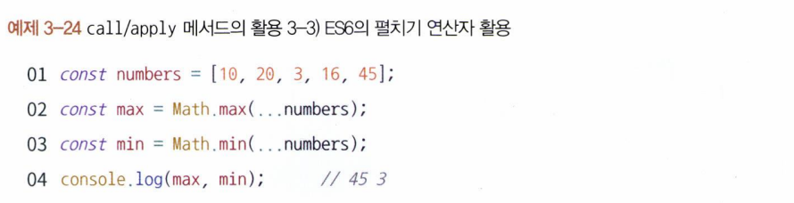

#### 3-2-4 bind 메서드

call과 비슷하지만 즉시 호출하지 않고 넘겨받은 this 및 인수를 바탕으로 새로운 함수를 반환하는 메서드

목적

- 함수에 this를 미리 적용
- 부분 적용 함수를 구현

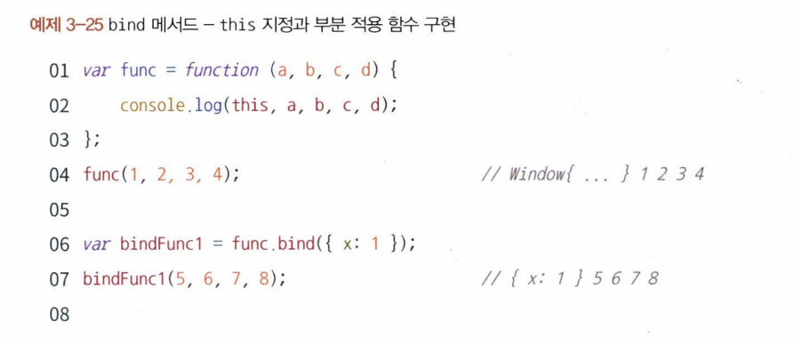
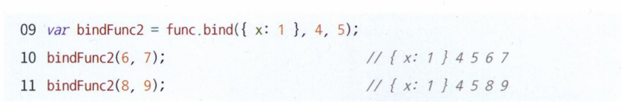

**name 프로퍼티**  
bind 메서드를 통해 만든 함수의 name에는 bound가 접두사로 붙음
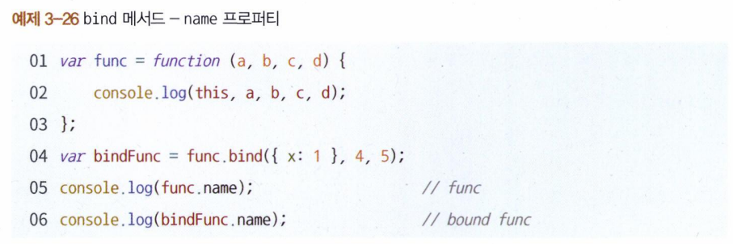

**상위 컨텍스트의 this를 내부함수나 콜백 함수에 전달하기**
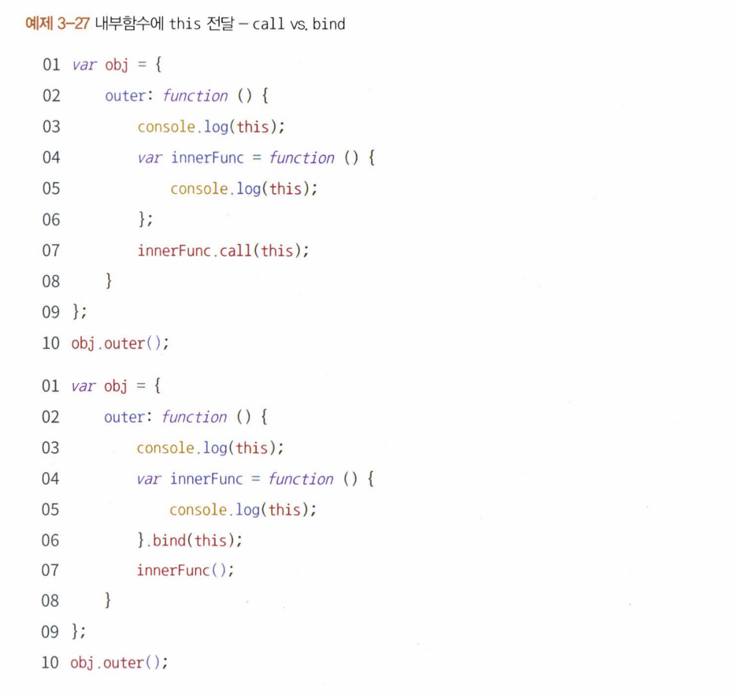

내부함수에 this를 전달할 수도 있다.
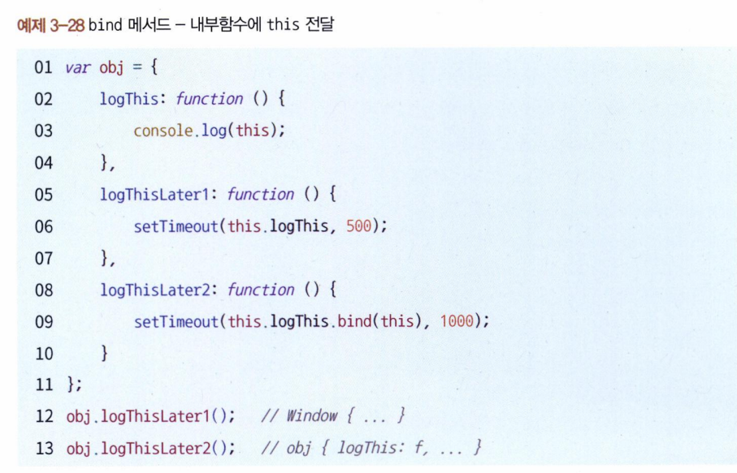

#### 3-2-5 화살표 함수의 예외사항

화살표 함수는 실행 컨텍스트 생성 시 this를 바인딩하는 과정이 제외됨  
-> 함수 내부에 this가 아예 없고, 스코프 체인상 가장 가까운 this에 접근함
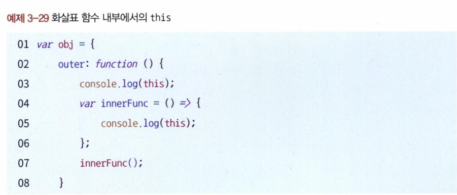
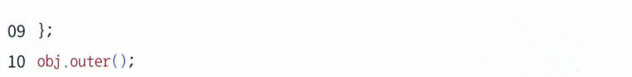

#### 3-2-6 별도의 인자로 this를 받는 경우(콜백 함수 내에서의 this)

콜백 함수를 인자로 받는 메서드 중 일부는 추가로 this로 지정할 객체를 인자로 지정할 수 있는 경우가 있다.  
이런 형태는 배열 메서드에 많이 포진되어 있다.  
Set, Map 등에도 일부 존재한다.
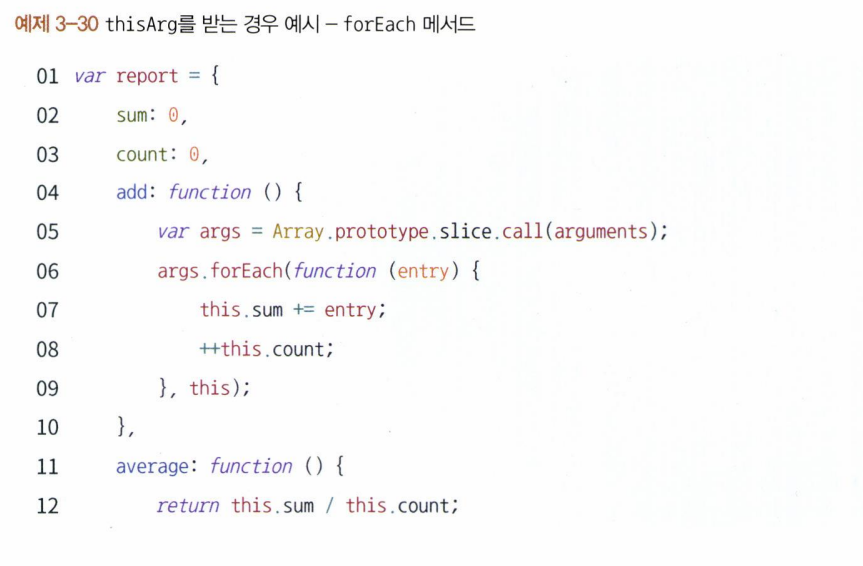
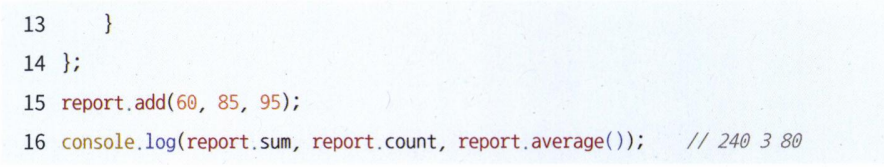

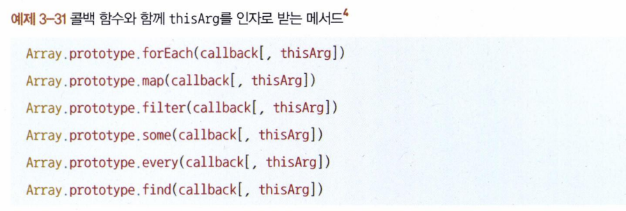
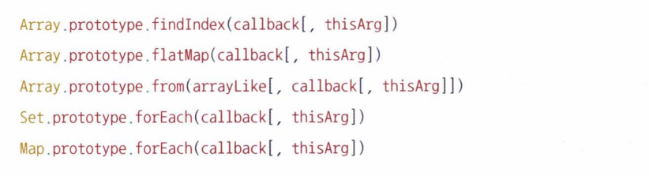
