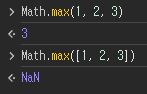

# 코어 자바스크립트

자바스크립트의 핵심 개념을 정확히 이해하기

[예제코드](https://github.com/wikibook/corejs)

# this

- JS에서 가장 혼란스러운 개념
    - 타 언어는 클래스에서만 쓸 수 있다
    - JS 에서는 어디서든 사용할 수 있다
- 함수와 객체의 구분이 느슨한 JS에서 this는 이 둘을 구분하는 거의 유일한 기능이다
    - 예상과 다른 대상을 바라보고 있을 경우 그 원인을 효과적으로 추적하는 방법을 살펴본다


## 상황에 따라 달라지는 this

- this 는 실행 컨텍스트가 생성될 때 결정된다

### 전역 공간

- 전역 공간에서 this는 전역 객체
- 전역 객체는 런타임 환경에 따라 다른 이름을 가짐
  - 브라우저 = window / Node.js = global
    - node 인터랙티브 환경에서 수행하면 global
    - node에 인자로서 파일을 전달하여 실행하면 module.exports

전역 변수를 선언하면 JS 엔진은 전역객체의 프로퍼티로도 할당한다.

>  정확히 말하면 프로퍼티로도 할당하는 게 아니라, 프로퍼티로 할당한다

- 변수이면서 동시에 객체의 프로퍼티

사실... JS의 모든 변수는 특정 객체의 프로퍼티로서 동작한다. 여기서  `특정 객체`는 실행 컨텍스트의 `LexicalEnvironment` (이하 L.E)를 말한다.

- 전역 변수 선언 vs 전역 객체 프로퍼티 할당
    - 거의 동일하게 동작하나, 삭제 명령 `delete` 연산의 경우 다르게 동작한다.
    - 변수는 삭제되지 않는다
        - 엔진에서 전역객체의 프로퍼티로 할당하면서 추가로 configurable 속성을 false로 설정한다 <<확인 필요>>

### 메서드로서 호출할 때 그 메서드 내부에서의 this

- 함수 vs 메서드
    - JS에서 메서드는 "객체의 메서드"로서 호출할 경우에만 메서드로 동작한다.


```js
var func = function(x) {
  console.log(this, x);
};
func(1); // Window { ... } 1

var obj = {
  method: func,
};
obj.method(2); // { method: f } 2
```

```js
var obj = {
  method: function(x) {
    console.log(this, x);
  },
};
obj.method(1); // { method: f } 1
obj['method'](2); // { method: f } 2
```

"객체의 메서드"로서 호출하는 방법은 위와 같이 함수 이름 앞에 객체가 명시되어 있는지를 확인하면 된다.

- 메서드 내부에서의 this
    - this에는 호출 주체 정보가 담긴다.

```js
var obj = {
  methodA: function() {
    console.log(this);
  },
  inner: {
    methodB: function() {
      console.log(this);
    },
  },
};
obj.methodA(); // { methodA: f, inner: {...} }    ( === obj)
obj['methodA'](); // { methodA: f, inner: {...} } ( === obj)

obj.inner.methodB(); // { methodB: f }            ( === obj.inner)
obj.inner['methodB'](); // { methodB: f }         ( === obj.inner)
obj['inner'].methodB(); // { methodB: f }         ( === obj.inner)
obj['inner']['methodB'](); // { methodB: f }      ( === obj.inner)
```

### 함수로서 호출할 때 그 메서드 내부에서의 this

- 함수로서 호출하면 this가 명시가 안 되었으나 전역 객체를 바라본다
    - 근데 더글라스 크락포드는 이를 명백한 설계상의 오류라고 지적한다

```js
var obj1 = {
  outer: function() {
    console.log(this); // (1)
    var innerFunc = function() {
      console.log(this); // (2) (3)
    };
    innerFunc();

    var obj2 = {
      innerMethod: innerFunc,
    };
    obj2.innerMethod();
  },
};
obj1.outer();
```

- 위 코드에서 this를 맞춰보자
    -  `(l)：obj1, (2)：전역객체(Window), (3)：obj2`
- this 바인딩은 해당 함수를 호출하는 구문 앞에 점 또는 대괄호 표기가 있는지에만 영향을 받는다. 메서드 내에서 호출되든, 함수 내에서 호출되든 중요치않다.

- 메서드의 내부 함수에서의 this를 우회하는 방법
    - 사실 호출 당시 주변 환경의 this를 그대로 상속받아 사용하는 게 직관적이다
    - this를 상속받아야 스코프 체인과의 일관성을 지키는 방식이다.
        - 변수 검색 => 가장 가까운 스코프 L.E 찾기 => 없으면 상위 컨텍스트 탐색
        - this 검색 => 현재 컨텍스트에서 찾기 => 없으면 상위 컨텍스트 탐색
    - 하지만 ES5 까지는 이를 지원하지 않는다...
    - 대신 우회 방법이 있다.

```js
var obj = {
  outer: function() {
    console.log(this); // (1) { outer: f }
    var innerFunc1 = function() {
      console.log(this); // (2) Window { ... }
    };
    innerFunc1();

    var self = this;
    var innerFunc2 = function() {
      console.log(self); // (3) { outer: f }
    };
    innerFunc2();
  },
};
obj.outer();
```

그냥  상위 스코프의 `this` 를 `self` 라는 이름으로 저장해서 내부함수에서 활용하면 된다...

- this 를 바인딩하지 않는 함수
    - ES6 에서는 this가 전역객체를 바라보는 문제를 해결하기 위해 화살표 함수를 도입했다
    - 화살표 함수는 실행 컨텍스트를 생성할 때 this 바인딩 과정자체가 빠진다.
    - 그래서 상위 스코프의 this를 그대로 활용 가능하다.

```js
var obj = {
  outer: function() {
    console.log(this); // (1) { outer: f }
    var innerFunc = () => {
      console.log(this); // (2) { outer: f }
    };
    innerFunc();
  },
};
obj.outer();
```

### 콜백 함수 호출 시 그 함수 내부에서의 this

- 콜백 함수에서 this 는 무조건적으로 정의할 수 없다
- 콜백 함수의 제어권을 가져가는 함수가 콜백 함수를 어떻게 호출할지 결정하기 때문이다.


```js
setTimeout(function() {
  console.log(this);
}, 300); // (1)

[1, 2, 3, 4, 5].forEach(function(x) {
  // (2)
  console.log(this, x);
});

document.body.innerHTML += '<button id="a">클릭</button>';
document.body.querySelector('#a').addEventListener('click', function(e) {
  // (3)
  console.log(this, e);
});
```

`(1), (2) = 전역객체 / (3) = addEventListener의 this(=button element)`

addEventListener의 매개변수 함수로 화살표 함수를 주면 window 객체가 출력된다. 화살표 함수는 call/apply 가 먹히지 않는데, addEventListener에서 this를 주입하는 방식이 call/apply 인듯하다

```js
my_element.addEventListener("click", function (e) {
  console.log(this.className); // logs the className of my_element
  console.log(e.currentTarget === this); // logs `true`
});

my_element.addEventListener("click", (e) => {
  console.log(this.className); // WARNING: `this` is not `my_element`
  console.log(e.currentTarget === this); // logs `false`
});
```

> this 안 쓰고 e.currentTarget 쓰면 익명 함수든 화살표 함수든 똑같이 동작한다.


### 생성자 함수 내부에서의 this

- 생성자는 구체적인 인스턴스를 만들기 위한 틀이다
    - JS에서는 함수에 생성자로서의 역할을 함께 부여했다.
    - new 명령어와 함께 함수를 호출하면 생성자로 동작한다.
    - 생성자로 호출된 함수 내에서 this는 새로 만들 인스턴스에 해당한다.

- 생성자 함수가 호출되면,
    - 생성자의 prototype 프로퍼티를 참조하는 __proto__ 프로퍼티가 있는 인스턴스를 만들고, 공통 속성 및 프로퍼티를 해당 객체(this)에 부여한다.

```js
var Cat = function(name, age) {
  this.bark = '야옹';
  this.name = name;
  this.age = age;
};
var choco = new Cat('초코', 7);
var nabi = new Cat('나비', 5);
console.log(choco, nabi);

/* 결과
Cat { bark: '야옹', name: '초코', age: 7 }
Cat { bark: '야옹', name: '나비', age: 5 }
*/
```

## 명시적으로 this를 바인딩하는 방법

### call 메서드

```js
var func = function(a, b, c) {
  console.log(this, a, b, c);
};

func(1, 2, 3); // Window{ ... } 1 2 3
func.call({ x: 1 }, 4, 5, 6); // { x: 1 } 4 5 6
```

- 메서드의 첫 번째 인자를 this로 바인딩하고, 나머지 모든 인자를 호출할 함수의 매개변수로 지정하여 즉시 호출한다.

### apply 메서드

```js
var func = function(a, b, c) {
  console.log(this, a, b, c);
};
func.apply({ x: 1 }, [4, 5, 6]); // { x: 1 } 4 5 6

var obj = {
  a: 1,
  method: function(x, y) {
    console.log(this.a, x, y);
  },
};
obj.method.apply({ a: 4 }, [5, 6]); // 4 5 6
```

- 메서드의 첫 번째 인자를 this로 바인딩하고, 두 번째 인자로 배열을 받아서 호출할 함수의 매개변수로 지정하여 즉시 호출한다.


### call / apply 메서드의 활용

- 유사배열객체 (array-like object) 에 배열 메서드 적용
    - **키가 0 또는 양의 정수인 프로퍼티가 존재**
    - **length 프로퍼티의 값이 0 또는 양의 정수**

```js
var obj = {
  0: 'a',
  1: 'b',
  2: 'c',
  length: 3,
};
Array.prototype.push.call(obj, 'd');
console.log(obj); // { 0: 'a', 1: 'b', 2: 'c', 3: 'd', length: 4 }

var arr = Array.prototype.slice.call(obj);
console.log(arr); // [ 'a', 'b', 'c', 'd' ]
```

- push: 배열 메서드
- slice: 시작/끝 인덱스값을 받아서 `[시작, 끝)` 범위의 배열 요소를 추출하는 메서드
    - 아무 것도 넘기지 않을 경우 원본 배열의 얕은 복사본 반환
    - 배열 메서드라서 배열을 return 한 것

```js
function a() {
  var argv = Array.prototype.slice.call(arguments);
  argv.forEach(function(arg) {
    console.log(arg);
  });
}
a(1, 2, 3);

document.body.innerHTML = '<div>a</div><div>b</div><div>c</div>';
var nodeList = document.querySelectorAll('div');
var nodeArr = Array.prototype.slice.call(nodeList);
nodeArr.forEach(function(node) {
  console.log(node);
});
```

- 함수 내부에서 접근 가능한 `arguments` 객체
    - 전달받은 인자를 가지고 있는 객체이고 유사배열객체
    - 매개변수 정의 안 해도 인자가 전달이 됨 = 개판


```js
var str = 'abc def';

Array.prototype.push.call(str, ', pushed string');
// Error: Cannot assign to read only property 'length' of object [object String]

Array.prototype.concat.call(str, 'string'); // [String {"abc def"}, "string"]

Array.prototype.every.call(str, function(char) {
  return char !== ' ';
}); // false

Array.prototype.some.call(str, function(char) {
  return char === ' ';
}); // true

var newArr = Array.prototype.map.call(str, function(char) {
  return char + '!';
});
console.log(newArr); // ['a!', 'b!', 'c!', ' !', 'd!', 'e!', 'f!']

var newStr = Array.prototype.reduce.apply(str, [
  function(string, char, i) {
    return string + char + i;
  },
  '',
]);
console.log(newStr); // "a0b1c2 3d4e5f6"
```

- 문자열도 유사배열객체로 볼 수 있음
    - 단 length 가 읽기 전용이므로 push, pop, shift, unshift, splice 등은 에러가 발생하며, Array.prototype.concat 처럼 배열 대상으로 설계된 메서드는 이상하게 동작함 (결과가 배열로 나옴)
    
```js
var obj = {
  0: 'a',
  1: 'b',
  2: 'c',
  length: 3,
};
var arr = Array.from(obj);
console.log(arr); // ['a', 'b', 'c']
```

- ES6 에서는 이터러블 객체를 위해서 모든 종류의 데이터 타입을 배열로 전환하는 `Array.from` 메서드가 도입


#### 생성자 내부에서 다른 생성자를 호출

```js
function Person(name, gender) {
  this.name = name;
  this.gender = gender;
}
function Student(name, gender, school) {
  Person.call(this, name, gender);
  this.school = school;
}
function Employee(name, gender, company) {
  Person.apply(this, [name, gender]);
  this.company = company;
}
var by = new Student('보영', 'female', '단국대');
var jn = new Employee('재난', 'male', '구골');
```

- 생성자 내부에서 다른 생성자를 나인 것처럼 호출해서 중복 구현을 막을 수 있다
    - 생성자 오버로딩인척하기

#### 여러 인수를 묶어 하나의 배열로 전달

```js
var numbers = [10, 20, 3, 16, 45];
var max = (min = numbers[0]);
numbers.forEach(function(number) {
  if (number > max) {
    max = number;
  }
  if (number < min) {
    min = number;
  }
});
console.log(max, min); // 45 3
```

- 최대/최소값을 구할 때 위와 같이 번거로움이 있다
- Math.max 메서드가 있지만 이건 인자를 배열로 받지 않는다



```js
var numbers = [10, 20, 3, 16, 45];
var max = Math.max.apply(null, numbers);
var min = Math.min.apply(null, numbers);
console.log(max, min); // 45 3
```

- apply 를 쓰면 인자를 배열로 전달할 수 있어서 Math.max 메서드를 사용할 수 있다.


```js
const numbers = [10, 20, 3, 16, 45];
const max = Math.max(...numbers);
const min = Math.min(...numbers);
console.log(max, min); // 45 3
```

- 그런데 사실 ES6부터는 스프레드 연산자가 있어서 그냥 쓸 수 있다

> call/apply 메서드는 this를 예측하기 어렵게 만든다. 하지만 ES5 이하에서는 대안이 없어서 어쩔 수 없이 쓰이고 있다.

### bind 메서드

```js
Function.prototype.bind(thisArg[, arg1[, arg2[, ...]]])
```

ES5 에서 추가된 기능으로 call과 비슷하지만 즉시 실행하지 않고 함수를 반환한다.

반환된 함수를 호출할 때 인수를 넘기면 기존 bind 메서드를 호출했을 때 전달했던 인수들의 뒤에 이어서 등록된다

```js
var func = function(a, b, c, d) {
  console.log(this, a, b, c, d);
};
func(1, 2, 3, 4); // Window{ ... } 1 2 3 4

var bindFunc1 = func.bind({ x: 1 });
bindFunc1(5, 6, 7, 8); // { x: 1 } 5 6 7 8

var bindFunc2 = func.bind({ x: 1 }, 4, 5);
bindFunc2(6, 7); // { x: 1 } 4 5 6 7
bindFunc2(8, 9); // { x: 1 } 4 5 8 9
```

- 용도
    - this를 미리 적용
    - 부분 적용 함수 구현
        - [커링](https://ko.javascript.info/currying-partials) 을 이용하면 함수가 일급객체인 언어에서 고차함수의 재사용성을 높일 수 있음

```js
// Logger 함수를 커링을 사용하여 정의
const createLogger = (level: string) => 
  (message: string) => 
    (req: Request, res: Response, next: NextFunction) => {
      console.log(`[${level}] ${message}: ${req.url}`);
      next();
    };


// 사용 예시
import express from 'express';
const app = express();

// 미들웨어 생성
const logInfo = createLogger('INFO')('Request Received');

// 미들웨어 사용
app.use(logInfo);

app.get('/', (req, res) => {
  res.send('Hello World!');
});

app.listen(3000, () => console.log('Server running on port 3000'));

```


#### name 프로퍼티

bind 메서드로 만들어진 함수는 독특한 성질이 있는데, name 프로퍼티에 bound 라는 접두어가 붙는다. 따라서 call, capply 보다 코드를 추적하기 쉽다.

```js
var func = function(a, b, c, d) {
  console.log(this, a, b, c, d);
};
var bindFunc = func.bind({ x: 1 }, 4, 5);
console.log(func.name); // func
console.log(bindFunc.name); // bound func
```

#### 상위 컨텍스트의 this를 내부함수나 콜백함수에 전달하기

self 변수 정의해서 내부 함수에 this를 전달하는 방법을 봤는데 더 깔끔하게 처리할 수 있다

```js
var obj = {
  outer: function() {
    console.log(this);
    var innerFunc = function() {
      console.log(this);
    };
    innerFunc.call(this);
  },
};
obj.outer();
```
```js
var obj = {
  outer: function() {
    console.log(this);
    var innerFunc = function() {
      console.log(this);
    }.bind(this);
    innerFunc();
  },
};
obj.outer();
```

콜백 함수에도 this를 쉽게 전달할 수 있다

```js
var obj = {
  logThis: function() {
    console.log(this);
  },
  logThisLater1: function() {
    setTimeout(this.logThis, 500);
  },
  logThisLater2: function() {
    setTimeout(this.logThis.bind(this), 1000);
  },
};
obj.logThisLater1(); // Window { ... }
obj.logThisLater2(); // obj { logThis: f, ... }
```


### 화살표 함수의 예외상황

화살표 함수는 실행 컨텍스트 생성 시 this를 바인딩하는 과정이 없다. 즉 this가 없고, 스코프체인상 가장 가까운 this에 접근해서 더 간결하다

```js
var obj = {
  outer: function() {
    console.log(this);
    var innerFunc = () => {
      console.log(this);
    };
    innerFunc();
  },
};
obj.outer();
```

### 별도의 인자로 this를 받는 경우 (콜백 함수 내 this)

콜백 함수를 인자로 받는 메서드 중 일부는 아예 매개변수로 this로 지정할 객체(thisArg)를 받는다. 이런 메서드는 콜백 함수 내부에서 this 값을 원하는 대로 변경할 수 있다.

이런 형태의 메서드는 내부 요소에 대해 같은 동작을 반복 수행해야하는 **배열 메서드**에 많다.

동일한 이유로 ES6에 추가된 Set, Map 등에도 일부 존재한다.

```js
var report = {
  sum: 0,
  count: 0,
  add: function() {
    var args = Array.prototype.slice.call(arguments);
    args.forEach(function(entry) {
      this.sum += entry;
      ++this.count;
    }, this);
  },
  average: function() {
    return this.sum / this.count;
  },
};
report.add(60, 85, 95);
console.log(report.sum, report.count, report.average()); // 240 3 80
```

대표적인 배열 메서드 forEach 예시

```js
Array.prototype.forEach(callback[, thisArg])
Array.prototype.map(callback[, thisArg])
Array.prototype.filter(callback[, thisArg])
Array.prototype.some(callback[, thisArg])
Array.prototype.every(callback[, thisArg])
Array.prototype.find(callback[, thisArg])
Array.prototype.findIndex(callback[, thisArg])
Array.prototype.flatMap(callback[, thisArg])
Array.prototype.from(arrayLike[, callback[, thisArg]])
Set.prototype.forEach(callback[, thisArg])
Map.prototype.forEach(callback[, thisArg])
```

## 정리

- 묵시적 this 바인딩
    - 전역공간: 전역객체 
    - 함수를 메서드로 호출: 호출 주체
    - 함수를 함수로 호출: 전역 객체 (메서드 내부 함수도 똑같다)
    - 함수를 생성자로 호출: 생성될 인스턴스
    - 콜백 내부 함수: 제어권을 넘겨받은 함수가 호출하는 방식에 따름
- 명시적 this 바인딩
    - call, apply 메서드: this/인자를 지정하면서 호출
    - bind: this/인자를 지정하면서 새로운 함수 생성
    - 순회 메서드: 별도 인자로 this를 받음
        - forEach, map, filter 등등