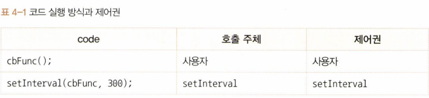

# 4장 콜백 함수

## 4-1 콜백 함수란?

콜백 함수는 다른 코드에게 **인자로 넘겨줌**으로써 그 **제어권**도 함께 위임한 함수이다.  
콜백 함수를 위임받은 코드는 자체적인 내부 로직에 의해 이 콜백 함수를 적절한 시점에 실행한다.

## 4-2 제어권

#### 4-2-1 호출 시점

```js
// setInterval의 매개변수
var intervalID = scope.setInterval(func, delay[, param1, param2, ...]);
```

```js
// 콜백 함수 예제 setInterval
var count = 0;
var timer = setInterval(function () {
  console.log(count);
  if (++count > 4) clearInterval(timer);
}, 300);
```

- 첫 번째 매개변수 : 익명 함수
- 두 번째 매개변수 : ms단위의 숫자
- 나머지 매개변수 : 익명 함수를 실행할 때 사용할 인자

```js
// 콜백 함수 예제 setInterval
var count = 0;
var cbFunc = function () {
  console.log(count);
  if (++count > 4) clearInterval(timer);
};
var timer = setInterval(cbFunc, 300);

// -- 실행 결과 --
// 0  (0.3초)
// 1  (0.6초)
// 2  (0.9초)
// 3  (1.2초)
// 4  (1.5초)
```

timer 변수에는 setInterval의 ID 값이 담긴다.  
0.3초에 한 번씩 숫자가 0부터 1씩 증가하며 출력됨



#### 4-2-2 인자

```js
// map 함수
Array.prototype.map(callback[, thisArg])
callback: function(currentValue, index, array)
```

map 메서드

- 첫 번째 인자 : callback 함수
- 두 번째 인자 : 내부에서 this로 인식할 대상(생략 가능)

```js
// Array.prototype.map
var newArr = [10, 20, 30].map(function (currentValue, index) {
  console.log(currentValue, index);
  return currentValue + 5;
});
console.log(newArr);

// -- 실행 결과 --
// 10 0
// 20 1
// 30 2
// [15, 25, 35]
```

콜백 함수의 제어권을 넘겨받은 코드는 콜백 함수를 호출할 때 인자에 어떤 값들을 어떤 순서로 넘길 것인지에 대한 제어권을 가진다.

#### 4-2-3 this

```js
// Array.prototype.map 직접 구현
Array.prototype.map = function (callback, thisArg) {
  var mappedArr = [];
  for (var i = 0; i < this.length; i++) {
    var mappedValue = callback.call(thisArg || window, this[i], i, this);
    mappedArr[i] = mappedValue;
  }
  return mappedArr;
};
```

- this : thisArg 값이 있을 경우에 그 값을, 없을 경우에는 전역객체를 지정
- 첫 번째 인자 : 배열의 i번째 요소 값
- 두 번째 인자 : i값
- 세 번째 인자 : 배열 자체(this)

```js
// 콜백 함수 내부에서의 this
setTimeout(function () {
  console.log(this);
}, 300); // (1) Window { ... }

[1, 2, 3, 4, 5].forEach(function (x) {
  console.log(this); // (2) Window { ... }
});

document.body.innerHTML += '<button id="a">클릭</button>';
document.body.querySelector("#a").addEventListener(
  "click",
  function (e) {
    console.log(this, e); // (3) <button id="a">클릭</button>
  } // MouseEvent { isTrusted: true, ... }
);
```

## 4-3 콜백 함수는 함수다

콜백 함수로 어떤 객체의 메서드를 전달하더라도 그 메서드는 메서드가 아닌 함수로서 호출된다.

```js
// 메서드를 콜백 함수로 전달한 경우
var obj = {
  vals: [1, 2, 3],
  logValues: function (v, i) {
    console.log(this, v, i);
  },
};
obj.logValues(1, 2); // { vals: [1, 2, 3], logValues: f } 1 2
[4, 5, 6].forEach(obj.logValues); // Window { ... } 4 0
// Window { ... } 5 1
// Window { ... } 6 2
```

## 4-4 콜백 함수 내부의 this에 다른 값 바인딩하기

```js
// 콜백 함수 내부의 this에 다른 값을 바인딩하는 방법 - 전통적인 방식
var obj1 = {
  name: "obj1",
  func: function () {
    var self = this;
    return function () {
      console.log(self.name);
    };
  },
};
var callback = obj1.func();
setTimeout(callback, 1000);
```

this를 사용하지도 않고, 번거롭다.

```js
// 콜백 함수 내부에서 this를 사용하지 않은 경우
var obj1 = {
  name: "obj1",
  func: function () {
    console.log(obj1.name);
  },
};
setTimeout(obj1.func, 1000);
```

this를 재활용할 수 없음

```js
// 콜백 함수 내부에서 this를 사용하지 않은 경우
var obj1 = {
  name: "obj1",
  func: function () {
    console.log(obj1.name);
  },
};
var obj2 = {
  name: "obj2",
  func: obj1.func,
};
var callback2 = obj2.func();
setTimeout(callback2, 1500);

var obj3 = { name: "obj3" };
var callback3 = obj1.func.call(obj3);
setTimeout(callback3, 2000);
```

```js
// 콜백 함수 내부의 this에 다른 값을 바인딩하는 방법(2) - bind 메서드 활용
var obj1 = {
  name: "obj1",
  func: function () {
    console.log(this.name);
  },
};
setTimeout(obj1.func.bind(obj1), 1000);

var obj2 = { name: "obj2" };
setTimeout(obj1.func.bind(obj2), 1500);
```

## 4-5 콜백 지옥과 비동기 제어

콜백 지옥 : 콜백 함수를 익명 함수로 전달하는 과정이 반복되어 코드의 들여쓰기 수준이 감당하기 힘들 정도로 깊어지는 현상

- 동기 : 현재 실행 중인 코드가 완료된 후에야 다음 코드를 실행
- 비동기 : 실행 중인 코드의 완료 여부와 무관하게 다음 코드로 넘어감(별도의 요청, 실행 대기, 보류)

```js
// 콜백 지옥 예시 (1-1)
setTimeout(
  function (name) {
    var coffeeList = name;
    console.log(coffeeList);

    setTimeout(
      function (name) {
        coffeeList += ", " + name;
        console.log(coffeeList);

        setTimeout(
          function (name) {
            coffeeList += ", " + name;
            console.log(coffeeList);

            setTimeout(
              function (name) {
                coffeeList += ", " + name;
                console.log(coffeeList);
              },
              500,
              "카페라떼"
            );
          },
          500,
          "카페모카"
        );
      },
      500,
      "아메리카노"
    );
  },
  500,
  "에스프레소"
);
```

```js
// 콜백 지옥 해결 - 기명함수로 변환
var coffeeList = "";

var addEspresso = function (name) {
  coffeeList = name;
  console.log(coffeeList);
  setTimeout(addAmericano, 500, "아메리카노");
};
var addAmericano = function (name) {
  coffeeList += ", " + name;
  console.log(coffeeList);
  setTimeout(addMocha, 500, "카페모카");
};
var addMocha = function (name) {
  coffeeList += ", " + name;
  console.log(coffeeList);
  setTimeout(addLatte, 500, "카페라떼");
};
var addLatte = function (name) {
  coffeeList += ", " + name;
  console.log(coffeeList);
};

setTimeout(addEspresso, 500, "에스프레소");
```

```js
// 비동기 작업의 동기적 표현(1) - Promise(1)
new Promise(function (resolve) {
  setTimeout(function () {
    var name = "에스프레소";
    console.log(name);
    resolve(name);
  }, 500);
})
  .then(function (prevName) {
    return new Promise(function (resolve) {
      setTimeout(function () {
        var name = prevName + ", 아메리카노";
        console.log(name);
        resolve(name);
      }, 500);
    });
  })
  .then(function (prevName) {
    return new Promise(function (resolve) {
      setTimeout(function () {
        var name = prevName + ", 카페모카";
        console.log(name);
        resolve(name);
      }, 500);
    });
  })
  .then(function (prevName) {
    return new Promise(function (resolve) {
      setTimeout(function () {
        var name = prevName + ", 카페라떼";
        console.log(name);
        resolve(name);
      }, 500);
    });
  });
```

내부에 resolve 또는 reject 함수를 호출하는 구문이 있을 경우 둘 중 하나가 실행되기 전까지는 다음으로 넘어가지 않음

```js
// 비동기 작업의 동기적 표현(2) - Promise(2)
var addCoffee = function (name) {
  return function (prevName) {
    return new Promise(function (resolve) {
      setTimeout(function () {
        var newName = prevName ? prevName + ", " + name : name;
        console.log(newName);
        resolve(newName);
      }, 500);
    });
  };
};
addCoffee("에스프레소")()
  .then(addCoffee("아메리카노"))
  .then(addCoffee("카페모카"))
  .then(addCoffee("카페라떼"));
```

함수화해서 짧게 표현한 형태

```js
// 비동기 작업의 동기적 표현(3) - Generator
var addCoffee = function (prevName, name) {
  setTimeout(function () {
    coffeeMaker.next(prevName ? prevName + ", " + name : name);
  }, 500);
};
var coffeeGenerator = function* () {
  var espresso = yield addCoffee("", "에스프레소");
  console.log(espresso);
  var americano = yield addCoffee(espresso, "아메리카노");
  console.log(americano);
  var mocha = yield addCoffee(americano, "카페모카");
  console.log(mocha);
  var latte = yield addCoffee(mocha, "카페라떼");
  console.log(latte);
};
var coffeeMaker = coffeeGenerator();
coffeeMaker.next();
```

\*가 붙은 함수가 바로 Generator 함수이다.
Generator 함수를 실행하면 Iterator가 반환되는데, Iterator는 next라는 메서드를 가지고 있다. 이 next 메서드를 호출하면 Generator 함수 내부에서 가장 먼저 등장하는 yield에서 함수의 실행을 멈춘다. 이후 다시 next 메서들 호출하면 앞서 멈췄던 부분부터 시작해서 그 다음에 등장하는 Yeild에서 함수의 실행을 멈춘다.  
**즉, 비동기 작업이 완료되는 시점마다 next 메서드를 호출하면 Generator 함수 내부의 소스가 위에서부터 아래로 순차적으로 진행된다.**
https://developer.mozilla.org/en-US/docs/Web/JavaScript/Reference/Global_Objects/Generator

```js
// 비동기 작업의 동기적 표현(4) - Promise + Async/await
var addCoffee = function (name) {
  return new Promise(function (resolve) {
    setTimeout(function () {
      resolve(name);
    }, 500);
  });
};
var coffeeMaker = async function () {
  var coffeeList = "";
  var _addCoffee = async function (name) {
    coffeeList += (coffeeList ? "," : "") + (await addCoffee(name));
  };
  await _addCoffee("에스프레소");
  console.log(coffeeList);
  await _addCoffee("아메리카노");
  console.log(coffeeList);
  await _addCoffee("카페모카");
  console.log(coffeeList);
  await _addCoffee("카페라떼");
  console.log(coffeeList);
};
coffeeMaker();
```

비동기 작업을 수행하고자 하는 함수 앞에 async를 표기하고, 함수 내부에서 실질적인 비동기 작업이 필요한 위치마다 await를 표기하는 것만으로 뒤의 내용을 Promise로 자동전환하고, 해당 내용이 resolve된 후에야 다음으로 진행함.
