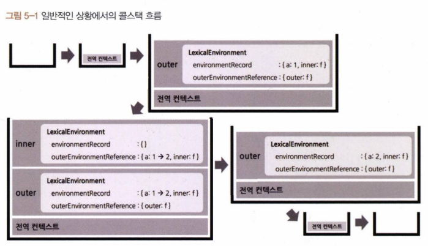
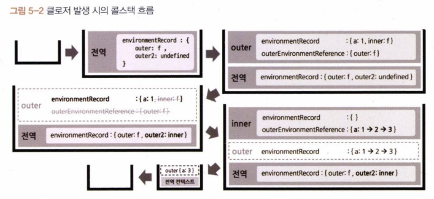

# 코어 자바스크립트

자바스크립트의 핵심 개념을 정확히 이해하기

[예제코드](https://github.com/wikibook/corejs)

## 정리

- 클로저란?
    - 어떤 함수에서 선언한 변수를 참조하는 내부함수를 외부로 전달할 경우, 함수의 실행 컨텍스트가 종료된 후에도 해당 변수가 사라지지 않는 현상
    - 내부 함수를 콜백으로 전달하는 경우도 포함
    - 메모리를 계속 차지하므로 사용하지 않게 된 클로저를 관리해야 함

## 의미와 원리 이해

- JS 고유의 개념이 아니라 ECMAScript 명세에도 정의가 없다.
- 다양한 문헌에서 제각각 설명

MDN 기준
- A closure is the combination of a function and the lexical environment within which that function was declared.
    - 클로저는 함수와 해당 함수가 선언된 lexical environment의 조합/결합
- 함수와 함수가 선언될 당시의 lexical environment와 상호관계에 따른 현상?
    - lexical environment = environmentRecord, outerEnvironmentReference
    - outerEnvironmentReference = 함수가 선언된 환경의 lexical environment 를 참조 복사

```js
var outer = function() {
  var a = 1;
  var inner = function() {
    console.log(++a);
  };
  inner();
};
outer();
```

- 외부 함수의 변수를 참조하는 내부 함수



---

```js
var outer = function() {
  var a = 1;
  var inner = function() {
    return ++a;
  };
  return inner;
};
var outer2 = outer();
console.log(outer2()); // 2
console.log(outer2()); // 3
```

- 외부 함수의 변수를 참조하는 내부 함수를 반환
    - outer 실행 컨텍스트가 종료되어도, inner 함수에서 outer 실행 컨텍스트에 접근할 수 있다 (변수 a 가 살아있)
    - GC는 참조되는 변수는 수집하지 않는다




---


클로저를 단순히 함수로 서술하기는 아쉽다. 클로저는 함수와 환경의 조합이다.

---

```js
// (1) setInterval/setTimeout
(function() {
  var a = 0;
  var intervalId = null;
  var inner = function() {
    if (++a >= 10) {
      clearInterval(intervalId);
    }
    console.log(a);
  };
  intervalId = setInterval(inner, 1000);
})();
```
```js
// (2) eventListener
(function() {
  var count = 0;
  var button = document.createElement('button');
  button.innerText = 'click';
  button.addEventListener('click', function() {
    console.log(++count, 'times clicked');
  });
  document.body.appendChild(button);
})();
```

리턴 없이도 클로저는 생길 수 있다.

## 메모리 관리

- 참조되는 변수는 수거되지 않는다.
- 불필요한 참조는 메모리 누수를 야기한다.
- 참조를 해제하려면 식별자에 null을 넣으면 된다.

```js
// (1) return에 의한 클로저의 메모리 해제
var outer = (function() {
  var a = 1;
  var inner = function() {
    return ++a;
  };
  return inner;
})();
console.log(outer());
console.log(outer());
outer = null; // outer 식별자의 inner 함수 참조를 끊음
```


```js
// (3) eventListener에 의한 클로저의 메모리 해제
(function() {
  var count = 0;
  var button = document.createElement('button');
  button.innerText = 'click';

  var clickHandler = function() {
    console.log(++count, 'times clicked');
    if (count >= 10) {
      button.removeEventListener('click', clickHandler);
      clickHandler = null; // clickHandler 식별자의 함수 참조를 끊음
    }
  };
  button.addEventListener('click', clickHandler);
  document.body.appendChild(button);
})();
```
사용이 끝난 식별자에 null을 할당한다.

## 클로저 활용 사례

### 콜백 함수 내부에서 외부 데이터 사용하고자 할 때

```js
var fruits = ['apple', 'banana', 'peach'];
var $ul = document.createElement('ul'); // (공통 코드)

fruits.forEach(function(fruit) {
  // (A)
  var $li = document.createElement('li');
  $li.innerText = fruit;
  $li.addEventListener('click', function() {
    // (B)
    alert('your choice is ' + fruit);
  });
  $ul.appendChild($li);
});
document.body.appendChild($ul);
```
(B)처럼 내부 함수를 클로저로 만들어서 fruit에 대한 참조를 들고 가면 쉽지만 재활용해야 하는 함수라고 가정하고 외부로 분리해보자.

```js
var fruits = ['apple', 'banana', 'peach'];
var $ul = document.createElement('ul');

var alertFruit = function(fruit) {
  alert('your choice is ' + fruit);
};
fruits.forEach(function(fruit) {
  var $li = document.createElement('li');
  $li.innerText = fruit;
  $li.addEventListener('click', alertFruit);
  $ul.appendChild($li);
});
document.body.appendChild($ul);
alertFruit(fruits[1]);
```
잘 동작할 것 같지만 li를 클릭했을 때 [object MouseEvent] 라는 값이 출력된다. addEventListener가 첫 번째 인자에 '이벤트 객체'를 주입해서 그렇다. `bind 메서드`를 쓰면 첫 번째 인자에 fruit을 미리 설정해둘 수 있다.

```js
var fruits = ['apple', 'banana', 'peach'];
var $ul = document.createElement('ul');

var alertFruit = function(fruit) {
  alert('your choice is ' + fruit);
};
fruits.forEach(function(fruit) {
  var $li = document.createElement('li');
  $li.innerText = fruit;
  $li.addEventListener('click', alertFruit.bind(null, fruit));
  $ul.appendChild($li);
});
document.body.appendChild($ul);
```
그런데 bind 메서드를 쓰면 this를 addEventListener가 제어할 수 없다. `고차 함수`를 쓰면 된다.

```js
var fruits = ['apple', 'banana', 'peach'];
var $ul = document.createElement('ul');

var alertFruitBuilder = function(fruit) {
  return function() {
    alert('your choice is ' + fruit);
  };
};
fruits.forEach(function(fruit) {
  var $li = document.createElement('li');
  $li.innerText = fruit;
  $li.addEventListener('click', alertFruitBuilder(fruit));
  $ul.appendChild($li);
});
document.body.appendChild($ul);
```
이렇게 하면 fruit 변수를 참조하는 클로저 함수를 콜백으로 넘겨줄 수 있다. 이 콜백 함수는 인자를 받아서 쓰지 않고, 외부환경을 직접 참조한다(클로저니까). 그래서 첫 번째 인자로 this를 받아도 동작이 변하지 않는다.

### 접근 권한 제어

public, private, protected 같은 게 없다. 대신 정보 은닉을 위해 클로저를 쓸 수 있다.

> [캡슐화](https://ko.wikipedia.org/wiki/%EC%BA%A1%EC%8A%90%ED%99%94)는 객체의 속성과 행위를 묶고, 내부 정보를 은닉하는 것

클로저를 활용하여, return을 통해서 외부 스코프에서 내부 변수에 대한 접근 권한을 부여할 수 있다.

```js
var car = {
  fuel: Math.ceil(Math.random() * 10 + 10), // 연료(L)
  power: Math.ceil(Math.random() * 3 + 2), // 연비(km/L)
  moved: 0, // 총 이동거리
  run: function() {
    var km = Math.ceil(Math.random() * 6);
    var wasteFuel = km / this.power;
    if (this.fuel < wasteFuel) {
      console.log('이동불가');
      return;
    }
    this.fuel -= wasteFuel;
    this.moved += km;
    console.log(km + 'km 이동 (총 ' + this.moved + 'km)');
  },
};
```

위와 같은 car 클래스는 데이터를 직접 변조가 가능하다.

```js
var createCar = function() {
  var fuel = Math.ceil(Math.random() * 10 + 10); // 연료(L)
  var power = Math.ceil(Math.random() * 3 + 2); // 연비(km / L)
  var moved = 0; // 총 이동거리
  return {
    get moved() {
      return moved;
    },
    run: function() {
      var km = Math.ceil(Math.random() * 6);
      var wasteFuel = km / power;
      if (fuel < wasteFuel) {
        console.log('이동불가');
        return;
      }
      fuel -= wasteFuel;
      moved += km;
      console.log(km + 'km 이동 (총 ' + moved + 'km). 남은 연료: ' + fuel);
    },
  };
};
var car = createCar();
```

위와 같이 클로저로 변수를 보호할 수 있다. 그리고 moved 변수에 대한 getter 함수를 제공해서, 내부 값에 접근할 수 있도록 했다. (=마치 읽기 전용 속성)

근데 run 메서드를 다른 내용으로 덮어씌울 수 있다.

```js
var createCar = function() {
  var fuel = Math.ceil(Math.random() * 10 + 10); // 연료(L)
  var power = Math.ceil(Math.random() * 3 + 2); // 연비(km / L)
  var moved = 0; // 총 이동거리
  var publicMembers = {
    get moved() {
      return moved;
    },
    run: function() {
      var km = Math.ceil(Math.random() * 6);
      var wasteFuel = km / power;
      if (fuel < wasteFuel) {
        console.log('이동불가');
        return;
      }
      fuel -= wasteFuel;
      moved += km;
      console.log(km + 'km 이동 (총 ' + moved + 'km). 남은 연료: ' + fuel);
    },
  };
  Object.freeze(publicMembers);
  return publicMembers;
};
var car = createCar();
```
근데 run 메서드를 다른 내용으로 덮어씌울 수 있다. 이거까지 막으려면 `Object.freeze(publicMembers);`와 같이 하면 된다.

### 부분 적용 함수

bind 메서드 같은 걸 말한다. 미리 인자를 세팅할 수 있는 함수다. 근데 bind 메서드는 this 값을 미리 변경할 수 밖에 없다.

대신 클로저를 활용해서 this 값에 영향을 주지 않는 부분 적용 함수를 만들 수 있다.

```js
Object.defineProperty(window, '_', {
  value: 'EMPTY_SPACE',
  writable: false,
  configurable: false,
  enumerable: false,
});

var partial2 = function() {
  var originalPartialArgs = arguments;
  var func = originalPartialArgs[0];
  if (typeof func !== 'function') {
    throw new Error('첫 번째 인자가 함수가 아닙니다.');
  }
  return function() {
    var partialArgs = Array.prototype.slice.call(originalPartialArgs, 1); // 부분 함수 생성시 받은 인자 (func 빼고 복사)
    var restArgs = Array.prototype.slice.call(arguments); // 실제 실행 시 추가로 받은 인자
    for (var i = 0; i < partialArgs.length; i++) { // placeholder 채우기
      if (partialArgs[i] === _) { 
        partialArgs[i] = restArgs.shift();
      }
    }
    return func.apply(this, partialArgs.concat(restArgs)); // 내부함수가 실행되는 시점의 this가 반영된다.
  };
};

var add = function() {
  var result = 0;
  for (var i = 0; i < arguments.length; i++) {
    result += arguments[i];
  }
  return result;
};
var addPartial = partial2(add, 1, 2, _, 4, 5, _, _, 8, 9);
console.log(addPartial(3, 6, 7, 10)); // 55

var dog = {
  name: '강아지',
  greet: partial2(function(prefix, suffix) {
    return prefix + this.name + suffix;
  }, '왈왈, '),
};
dog.greet(' 배고파요!'); // 왈왈, 강아지 배고파요!
```

greet는 부분 적용 함수임에도, dog.greet가 호출된 시점의 this 즉 dog가 잘 적용이 되어있다. (this.name = 강아지)


> 참고) ES5 환경에서 _를 비워놓음으로 사용하기 위해 전역 공간을 침범함. ES6에선 Symbol.for 를 사용하면 된다. 

```js
    for (var i = 0; i < partialArgs.length; i++) { // placeholder 채우기
      // if (partialArgs[i] === _) { 
      if (partialArgs[i] === Symbol.for(' EMPTY_SPACE')) {
        partialArgs[i] = restArgs.shift();
      }
    }

```
---


실무 예시로 `debounce` 가 있다.

짧은 시간 동안 동일 이벤트가 많이 발생하는 경우, 처음 또는 마지막 이벤트만 처리하는 것으로, 성능 최적화 기법 중 하나이다.

```js
var debounce = function(eventName, func, wait) {
  var timeoutId = null;
  return function(event) {
    var self = this;
    console.log(eventName, 'event 발생');
    clearTimeout(timeoutId);
    timeoutId = setTimeout(func.bind(self, event), wait);
  };
};

var moveHandler = function(e) {
  console.log('move event 처리');
};
var wheelHandler = function(e) {
  console.log('wheel event 처리');
};
document.body.addEventListener('mousemove', debounce('move', moveHandler, 500));
document.body.addEventListener(
  'mousewheel',
  debounce('wheel', wheelHandler, 700)
);
```
출력 용도로 지정한 eventName, 실행할 함수(func), 마지막으로 발생한 이벤트인지 여부를 판단하기 위한 대기시간(wait(ms))

- setTimeout을 통해, 이벤트 발생 후 wait (ms) 동안 동일 이벤트 발생하지 않으면 콜백 실행
- 콜백 함수의 this가 setTimeout에 의해 망가지지 않게 bind 해줌
- wait 이내에 재실행되면 timeoutId 통해서 등록한 setTimeout을 취소하고 재등록
- 마지막에 발생한 이벤트만 실행됨

### 커링 함수

여러 개의 인자를 받는 함수를, 하나의 인자만 받는 함수로 나눠서 순차적으로 호출할 수 있게 체인 형태로 구성한 것.

한번에 하나의 인자만 전달하는 것을 원칙으로 한다.

커링 함수는 마지막 인자가 들어올 때까지 함수 실행을 미루는 효과가 있다. 이를 lazy execution 이라고 한다.

```js
var getlnformation = function (baseUrl) { // 서버에 요청할 주소의 기본 URL
    return function (path) { // path 값
        return function (id) { // id 값
            return fetch(basellrl + path + '/' + id)； // 실제 서버에 정보를 요청.
        };
    };
};

// ES6
var getlnformation = baseUrl => path => id => fetch(baseUrl + path + '/' + id);
```
baseUrl은 고정되지만 path, id는 많을 수 있다. 공통 요소만 먼저 주고 나머지 만으로 서버 요청 수행하는 함수 만들어두면 효율성, 가독성이 좋다.

```js
// Redux Middleware 'Logger'
const logger = store => next => action => {
    console.log('dispatching'z action);
    console.log('next state'z store.getState());
    return next(action);
};
// Redux Middleware 'thunk'
const thunk = store => next => action => {
    return typeof action === 'function'
        ? action(dispatch, store.getState)
        : next(action);
};
```

Flux 아키텍처의 구현체 중 하나인 Redux 미들웨어 예시

- store: 프로젝트 내 한번 생성 이후 바뀌지 않음
- next: 상동 (distpatch의 의미를 가짐)
- action: 매번 달라짐
