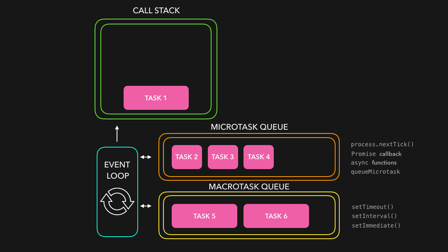
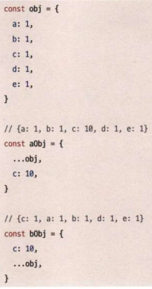
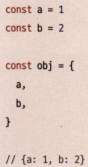

# 1장 리액트 개발을 위해 꼭 알아야 할 자바스크립트

## 1.1 자바스크립트의 동등 비교

JS의 객체 비교의 불완정성은 다른 함수형 언어에서는 볼 수 없는 특징이므로 꼭 기억해두어야 한다.

따라서 자바스크립트 기반으로 한 리액트의 함수형 프로그래밍 모델도 한계가 있고 얕은 비교만을 사용해서 비교를 수행해 필요한 기능을 구현하고 있다.

잘 숙지해야 아래 내용을 쉽게 이해할 수 있다.

- 함수 컴포넌트에 사용되는 훅의 의존성 배열의 비교
- 렌더링 방지를 넘어선 useMemo Usecallback의 필요성
- 렌더링 최적화를 위해 꼭 필요한 React.memo 를 사용하기 위해 고려할 것

## 1.2 함수

- 정의 방법 4개
    - 함수 선언문
    - 함수 표현식
    - Function 생성자
    - 화살표 함수
- 다양한 함수
    - 즉시 실행 함수
    - 고차 함수 (ex. Array.prototype.map)
- 함수를 만들 때 주의 사항
    - 부수 효과 억제
    - 작은 함수
    - 이해할 수 있는 이름

## 1.3 클래스

### 클래스란?
- constructor
- property
- getter, setter
- 인스턴스 메서드 (프로토타입 메서드)
- 정적 메서드
    - this 접근 불가
- 상속 (extends)

### 클래스와 함수의 관계

- 클래스는 ES6에 등장. 프로토타입을 활용하는 것
- 그냥 syntactic sugar


## 1.4 클로저

### 클로저의 정의

> 함수와 함수가 선언된 어휘적 환경(Lexical Scope)의 조합

### 스코프

- 전역 스코프
- 함수 스코프

### 클로저의 활용

- 변수 은닉
- 리액트에서는?
    - state 관리에 활용
    - 외부함수: useState
    - 내부함수: setState
- 블록 레벨 스코프
    - let은 블록 레벨 스코프를 따른다
- 주의사항
    - 메모리 이슈
    - 클로저는 선언된 환경을 기억해야 하므로 내부함수가 호출되든 말든 메모리에 올려둔다

## 1.5 이벤트 루프와 비동기 통신의 이해

- JS는 싱글 스레드 동기 방식으로 작동한다.
- 근데 비동기 작업이 이루어지고 있다.
- 리액트는 렌더링 스택 비우는 방식으로 구현됐었는데, 지금은 비동기 작업으로 된다.
- 어떻게 되는걸까?

### 싱글 스레드 JS

- JS 만들어질 당시엔 싱글 스레드가 당연해서 그랬다. 코드를 한줄씩 완료시키는 걸 Run-to-completion 라고 한다.

### 이벤트 루프 // 추가 정리 필요

[이벤트 루프 시각화](https://dev.to/lydiahallie/series/3341)

> V8 기준으로 작성됨

- 이벤트 루프는 ECMAScript에 없다. 근데 비동기 코드 처리를 위해 만든 거다
- 호출 스택
    - 수행할 함수를 순차적으로 담아둔 스택
- 이벤트 루프
    - 호출 스택을 처리하고, 다했으면 태스크 큐를 처리하는 역할
- 태스크 큐 (매크로 태스크 큐)
    - 이벤트 루프는 한 개 이상의 태스크 큐를 갖는다
    - 근데 queue가 아니라 set이다.
    - 실행 가능한 가장 오래된 태스크를 뱉는다
- 함수 실행은 누가 하나?
    - 메인 스레드가 아니라 태스크 큐가 할당되는 별도의 스레드에서 처리
    - 별도 스레드에서 태스크 큐에 작업을 할당해 처리하는 건 브라우저, Node.js의 역햘

### 태스크 큐와 마이크로 태스크 큐



- 태스크 큐
    - setTimeout
    - setInterval
- 마이크로 태스크 큐
    - 태스크 큐 보다 우선권이 높다.
    - Promise

- 실행 순서
    - 마이크로 태스크 큐: process.nextTick, Promises, queueMicroTask, MutationObserve
    - 마이크로 태스크 작업 끝날 때마다 브라우저 렌더링 기회 얻음
    - 태스크 큐: setTimeout. setinterval, setlmmediate

## 리액트에서 자주 사용하는 JS 문법

### 구조 분해 할당

#### 배열
```js
const array = [1,2,3,4,5]
const [f, s, t, ...arrayRest] = array
```
spread operator 이용해서 나머지를 다시 배열로 만들 수 있음

#### `,` 이용해서 위치 지정 할 수 있음
```js
const array = [1,2,3,4,5]
const [first, ,,, five] = array
```

#### 기본값 설정 가능
```js
const array = [1,2]
const [a=10, b=10, c=10] = array // c는 10 된다.
```
참고: undefined 일 때만 기본값이 설정된다.

#### 객체 구조 분해 할당

```js
const object = {
    a: 1,
    b: 2,
    c: 3,
    d: 4,
    e: 5,
}
const { a, b, c, ...objectRest } « object
// a 1
// b 2
// c 3
// objectRest = {d: 4, e: 5}
```

배열하고 똑같다.

```js
function Samplecomponent({ a, b }) {
    return a + b
}
SampleComponent({ a: 3, b: 5 }) // 8
```
파라미터에도 적용 된다.

```js
const key = 'a'
const object = {
    a: 1,
    b: 1,
}
const { [key]: a } = object
// a = 1
```
계산된 속성으로 가져올 수도 있는데 특이하게 변수 이름을 오른쪽으로 지정해야 한다. (계산된 속성은 value니까 당연히 이름이 필요하다)

> 객체 구조 분해 할당은 번들링 크기가 크다. 꼭 쓰고 싶다면외부 라이브러리 사용도 고려해볼만 하다

### 전개 구문

#### 배열 전개

```js
const arrl = ['a', 'b']
const arr2 = [...arrl, 'c', 'd', 'e'] // ['a, 'b', 'c, 'd', e’]
```
참조를 복사한다.

#### 객체 전개



똑같다. 단, 같은 이름의 속성이 있을 경우 뒤에 오는 게 우선 시 된다. (덮어쓰기 됨)

#### 객체 초기자

object shorthand assignment



#### Array 프로토타입 메서드

- map, filter, reduce, forEach

map: 배열의 원소에 함수를 적용하여 그 값을 모아 배열로 반환
```js
const arr = [1, 2, 3, 4, 5]
const Elements = arr.map((item) => {
    return <Fragment key={item}>{item}</Fragment>
})
```

filter: 배열의 원소 중 조건을 만족하는 원소만 모아 배열로 반환
```js
const arr = [1, 2, 3, 4, 5]
const evenArr = arr.filter((item) => item % 2 = 0)
// [2, 4]
```

reduce: 배열을 원소로 축소하여 반환
```js
const arr = [1, 2, 3, 4, 5]
const sum = arr.reduce((result, item) => {
    return result + item
}, 0)
// 1
```

forEach: 반환값이 없는 map
```js
const arr = [1, 2, 3]
arr.forEach((item) => console.log(item))
```

#### 삼항 조건 연산자

```js
const value = useHemo(
() => (conditionl ? '1' : condition2 ? '2' : condition3 ? '3' : 'else'),
[conditionl, condition2, condition3],
```

중첩해서 쓸 수도 있는데 가독성 나쁘니 지양

## (사실상 번외) 타입스크립트

- JS의 super set 
- 타입 체크를 런타임이 아닌 트랜스파일 타임에 수행할 수 있게 해준다
- 이전에 Flow 라는 정적 타입 체크 라이브러리가 있었다
- 지금은 타입스크립트로 거의 대체되었다 (vscode의 강력한 지원, Definitely Typed를 바탕으로 기존 라이브러리의 타입 지원)
    - Definitely Typed: JS로만 작성된 라이브러리를 위해 별도의 타입스크립트 타입을 제공하는 라이브러리
    - `@types`가 Definitely Typed 다
- react 는 flow 로 작성되어 있지만 `@types/react` 라이브러리의 등장으로 타입스크립트에서도 Flow 수준으로 매끄럽게 리액트 코드를 작성할 수 있다.

### 리액트 코드 효과적 작성 위한 타입스크립트 활용법

#### never
- any 대신 unknown
    - 둘 다 아무 값이나 할당할 수 있는 top type
    - 그런데 any와 다르게 unknown은 바로 사용할 수 없다.

bottom type 인 `never` 도 있다.

어떤 타입도 들어올 수 없음을 의미한다.

```js
type whatl = string & number
type what2 = ('hello' | 'hi') & 'react
```
what1, what2 둘다 never 다

타입스크립트로 클래스 컴포넌트를 선언할 때 props는 없지만 state가 존재하는 상황에서 이 빈 props，정확히는 어떠한 props도 받아들이지 않는다는 뜻으로 사용이 가능하다.


```js
// string이 키지만 값은 never다. 즉 어떠한 값도 올 수 없다.
type Props = Record<string, never>
type State = {
    counter: 0
}
class Samplecomponent extends React.Component<Props, State> {
    constructor(props: Props) {
        super(props)
        this.state = {
        counter: 0,
    }
}
render() {
return <>...</>
}
export default function App() {
return (
        <>
            {/* OK */}
            <SampleComponent />
            {/* Type 'string' is not assignable to type 'never' */}
            <SampleComponent hello=',world" />
        </>
    )
}
```

#### 타입 가드

최대한 타입을 좁히는 것이 좋다.

- instanceof, typeof
- in
    - 객체에 key가 있는지 확인하는 용도

```js
function doSchool(person: Student } Teacher) {
    if ('age' in person) {
        person.age // person= Student
        person.score
    }
    if ('name' in person) {
        person.name // person= Teacher
    }
}
```

#### 제네릭

unknown 보다 좀더 좁혀서 다루고 싶을 때

```js
function getFirstAndLast<T>(list: T[]): [T, T] {
    return [list[0], list[list.length - 1]]
}
const [first, last] = getFirstAndLast([1, 2, 3, 4, 5])
first // number
last // number
const [first, last] = getFirstAndLast(['a', 'b', 'c', 'd', 'e'])
first // string
last //string
```

```js
function Component() {
// state: string
const [state, setState] = useState<string>('')
// ...
}
```
useState에 제네릭으로 타입을 선언한다면 state 사용과 기본값 선언을 좀 더 명확하게 할 수 있다. 흔히 useState()와 같은 형식으로 기본값을 넘기지 않고 사용하는 경우가 많은데, 이 경우 값을 undefined로 추론해 버리는 문제가 발생한다. 제네릭으로 기본값을 선언해 준다면 이러한 문제를 타입스크립트가 방지해 줄 수 있다.

### 인덱스 시그니처

```js
type Hello = {
    [key: string]: string
}

const hello: Hello = {
    hello: 'hello',
    hi: 'hi',
}

hello['hi'] // hi
hello['안녕'] // undefined
```

키에 원하는 타입을 부여할 수 있다. 근데 위처럼 타입이 너무 넓으면 undefined가 나올 수 있다.

```js
type Hello = Record<'hello' | 'hi', string>
```
Record를 통해 좁힐 수 있고

```js
type Hello = { [key in 'hello' | 'hi']: string }
```
매핑된 타입으로 좁힐 수 있다.

- 매핑된 타입은 기존의 타입의 키를 기반으로 새로운 타입을 만들 때 사용
    - 키: 문자열 유니언 ('hello' | 'hi')
    - 각 키에 대해 string 타입의 값을 할당할 수 있도록 정의

- Object.keys()
    - string[] 을 반환한다.
    - 이 메서드를 통해 hello[key] 처럼 접근할 수 없다는 말

```js
Object.keys(hello).map((key) => {
    const value = hello[key as keyof Hello]
    return value
}
```

이렇게 `as keyof` 로 단언해서 사용해야 한다.

왜??

JS는 열린 구조이고 덕 타이핑으로 객체를 비교한다. 필요한 변수와 메서드가 있으면 해당 타입으로 인정을 해준다. 객체의 key에는 뭐든지 들어올 수 있으므로 이에 대응하기 위해 string[]으로 타입을 제공한다.

### 타입스크립트 전환 가이드

#### tsconfig.json 먼저 작성

#### JSDoc과 @ts-check 활용해 점진적 전환


#### 타입기반 라이브러리 사용을 위해 @types 모듈 설치

#### 파일 단위로 조금씩 전환하기