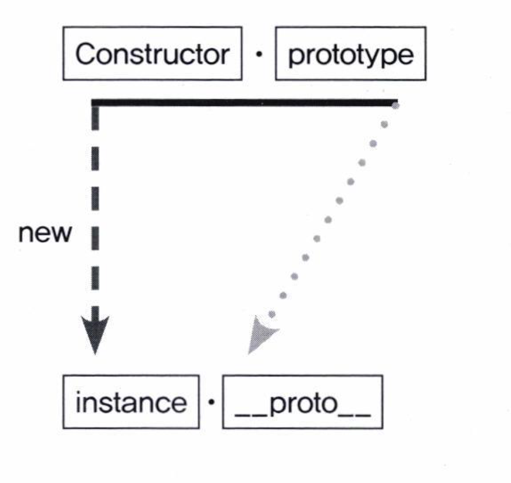
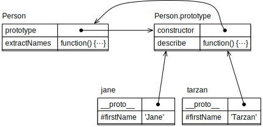
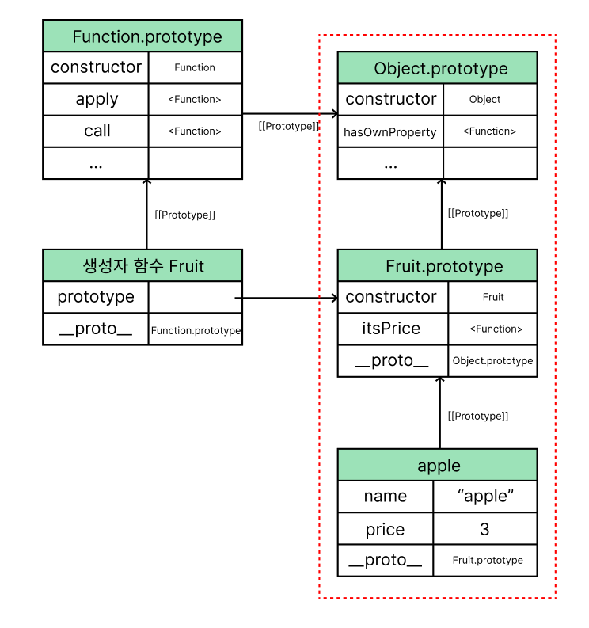

# Chapter 6. 프로토타입

## 프로토타입이란?

- 새로운 객체가 생성되기 위한 원형이 되는 객체
- 어떤 객체를 ‘원형(prototype)’으로 삼고, 이를 복제(참조)하여 상속과 비슷한 효과를 얻음
- 자바스크립트는 클래스 기반 언어가 아닌 ‘프로토타입’ 기반의 언어

## 프로토타입의 개념 이해

### constructor, prototype, instance

1. constructor : 생성자, 함수본인
2. prototype : 자신이 다른 객체의 원형이 되는 객체
3. instance : 클래스의 새로이 만들어진 ***인스턴스***가 자유롭게 사용할 수 있는 그 클래스의 메소드





- Person : Constructor
- Jane, tarzan : instance
- 어떤 생성자 함수(Constuctor)를 new 연산자와 함게 호출하면 Consturctor의 정의를 바탕으로 새로운 인스턴스가 생성됨
- 이때 인스턴스에는 __proto__라는 프로퍼티가 자동으로 부여되는데, 이 프로퍼티는 Constructor의 prototype이라는 프로퍼티를 참조합니다.
    - 여기서 prototype은 객체이며, 객체 내부에 인스턴스가 사용할 메서드를 저장함
    - 인스턴스는 __proto__ 를 통해 메서드들에 접근할 수 있게됨

```jsx
var Person = function(name) {
	this._name = name;
};
Person.prototype.getName = function() {
	return this._name;
};

var mueng = new Person('mueng');
mueng.__proto__.getName(); //undefined;
// 바인딩된 대상이 잘못 지정됨

Person.prototype === mueng.__proto__ // true
```

- 따라서 __proto__의 프로퍼티를 쓰면 됨 (생략이 가능하기 때문)

```jsx
var mueng = new Person('mueng', 27);
mueng.getName();
var tj = new Person('tj', 30);
tj.getName();
```

[결론]

- new 연산자로 Constuctor를 호출하면 instance가 만들어지는데, 이 instance의 생략 가능한 프로퍼티인 __proto__는 Constuctor의 prototype을 참조한다!

[참고]

- 자바스크립트에서는 합수에 자동으로 prototype 프로퍼티를 생성해 놓는데, 해당 함수를 new 연산자와 함께 함수를 호출할 경우, 그로부터 생성된 인스턴스에는 숨겨진 프로퍼티(__proto__)가 자동으로 생성되며, 이는 생성자 함수의 prototype 프로퍼티를 참조하게 됨.
- __proto__는 생략이 가능하기 때문에 생성자 함수의 prototype의 메서드나 프로퍼티를 자신의 것처럼 접근할 수 있게 됨.


- 그러나 Array라는 생성자 함수를 원형으로 arr라는 변수를 생성한 경우, arr는 Array 함수의 정적 메서드인 from, isArray, of 등은 사용할 수 없음
- Array의 prototype 프로퍼티 내부에 있지 않기 때문.
    - Array 생성자 함수에서 직접 접근해야 실행이 가능해짐

```jsx
var arr = [1,2];
arr.forEach(function() {}); // (O) 
Array.isArray(arr); // (O) true
arr.isArray(); // (X) Type Error
```

### constructor 프로퍼티

1. 원래의 생성자 함수(자기 자신)을 참조함

```jsx
var arr = [1, 2];
Array.prototype.constructor === Array; // true
arr.__proto__.constructor === Array; // true
arr.constructor === Array; // true

var arr2 = new arr.constructor(3, 4);
console.log(arr2); // [3, 4]
```

- 읽기 전용 속성이 부여된 예외적인 경우를 제외하고는 값을 바꿀 수 있음 (number, string, boolean )
- 하단은 모두 동일한 객체(prototype)에 접근할 수 있음
    - [Constructor].prototype
    - [instance].__proto__
    - [instance]
    - object.getPrototypeOf([instance])

## 프로토타입 체인

### 메서드 오버라이드

- 만약 인스턴스가 동일한 이름의 프로퍼티 또는 메서드를 가지고 있는 상황이라면?

```jsx
var Person = function(name) {
  this.name = name;
};
Person.prototype.getName = function() {
  return this.name;
};

var iu = new Person('지금');
iu.getName = function() {
  return '바로 ' + this.name;
};
console.log(iu.getName()); // 바로 지금
```

- Person.prototype.getName이 아닌, iu.getName이 실행됨 ⇒ **메서드 오버라이드**
- 원본을 제거하는것이 아닌, 덮어씌우는 형태
- 메서드 오버라이딩이 이뤄져 있는 상황에서 prototype에 있는 메서드에 접근하려면?
    - iu.__proto__.getName()
    - 위에서 this는 prototype을 바라보고 있기 때문에, call이나 apply를 이용하여 바꿔줘야함
        - iu.__proto__getName.call(iu)

### 프로토타입 체인




- 여기서 arr는 Array의 메서드 -> Object의 메서드를 모두 자신의 것처럼 실행할 수 있음.
- 어떤 데이터의 프로퍼티 내부에 다시 프로퍼티가 연쇄적으로 이어진 것을 프로토타입 체인이라고 함
- 모든 데이터 타입의 최상단에는 Object가 있다는 점을 참고

### 객체 전용 메서드의 예외사항

- 객체 안에서만 사용할 메서드는 Object의 프로토타입 객체 안에 정의할 수 없음. (다른 데이터 타입도 해당 메서드를 사용할 수 있게 되기 때문)
    - 객체 전용 메서드들은 Object.prototype이 아닌 Object에 스태틱 메서드로 부여해야함.
- 따라서 Object.prototype에는 어떤 데이터에서도 활용할 수 있는 범용적인 메서드들만 있음
    - toString, hasOwnProperty, calueOf, isPrototypeOf 등

### 다중 프로토타입 체인

- 두 단계 이상의 체인을 지니는 다중 프로토타입 체인도 가능함

## 정리

- 어떤 생성자 함수를 new 연산자와 함께 호출하면 Constuctor에서 정의된 내용을 바탕으로 새로운 인스턴스가 생성됨.
- 인스턴스에는 __proto__라는 Consturctor의 prototype 프로퍼티를 참조하는 프로퍼티가 자동으로 부여됨.
- __proto__는 생략이 가능한 속성이라, Constructor.prototype의 메서드를 마치 자신의 메서드인 것처럼 호출이 가능함
- Constructor.prototype에는 constructor라는 프로퍼티가 있는데, 이는 생성자 함수 자신을 가르킴
    - 자신의 생성자 함수가 무엇인지를 알고자 할 때 필요한 수단
- __proto__를 계속 찾아가면 최종적으로는 Object.prototype에 당도하게 됨. ⇒ 프로토타입 체이닝
    - 각 프로토타입 메서드를 자신의 것처럼 호출할 수 있음
    - 자신으로부터 가장 가까운 대상부터 점차 먼 대상으로 나아감.
- 프로토타입 체인은 무한대로 단계 생성이 가능함.
