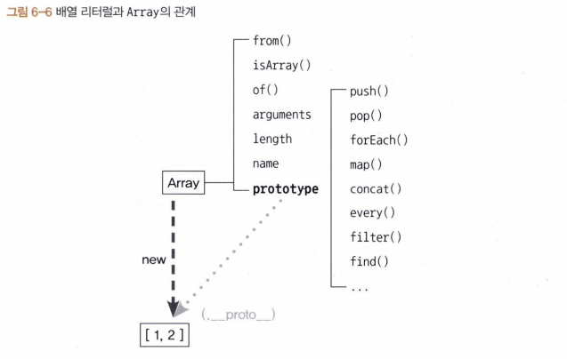

# 6장 프로토타입

프로토타입 기반 언어에서는 어떤 객체를 원형(prototype)으로 삼고 이를 복제(참조)함으로써 상속과 비슷한 효과를 얻는다.

## 6-1 프로토타입의 개념 이해

#### 6-1-1 constructor, prototype, instance

  
어떤 생성자 함수(constructor)를 new 연산자와 함께 호출하면 constructor에서 정의된 내용을 바탕으로 새로운 인스턴스가 생성된다.

이때 instance에는 **proto**라는 프로퍼티가 자동으로 부여되는데, 이 프로퍼티는 constructor의 prototype이라는 프로퍼티를 참조한다.

```js
var Person = function (name) {
  this._name = name;
};
Person.prototype.getName = function () {
  return this._name;
};

// Person의 인스턴스는 __proto__프로퍼티를 통해 getName을 호출할 수 있다.
```

**proto** : 생략가능한 프로퍼티  
-> 생성자 함수의 prototype에 어떤 메서드나 프로퍼티가 있다면 인스턴스에서도 마치 자신의 것처럼 해당 메서드나 프로퍼티에 접근할 수 있다.




인스턴스의 **proto**는 Array.prototype을 참조하는데, **proto**가 생략가능하도록 설계되어있기 때문에 인스턴스가 push, pop 등의 메서드를 마치 자신의 것처럼 호출할 수 있다.

#### 6-1-2 constructor 프로퍼티

```js
var arr = [1, 2];
Array.prototype.constructor === Array; // true
arr.__proto__.constructor === Array; // true
arr.constructor === Array; // true

var arr2 = new arr.constructor(3, 4);
console.log(arr2); // [3, 4]
```

constructor : 생성자 함수(자기자신)을 참조

```js
var NewConstructor = function () {
  console.log("this is new constuctor!");
};
var dataTypes = [
  1, // Number & false
  "test", // String & false
  true, // Boolean & false
  {}, // NewConstructor & false
  [], // NewConstructor & false
  function () {}, // NewConstructor & false
  /test/, // NewConstructor & false
  new Number(), // NewConstructor & false
  new String(), // NewConstructor & false
  new Boolean(), // NewConstructor & false
  new Object(), // NewConstructor & false
  new Array(), // NewConstructor & false
  new Function(), // NewConstructor & false
  new RegExp(), // NewConstructor & false
  new Date(), // NewConstructor & false
  new Error(), // NewConstructor & false
];

dataTypes.forEach(function (d) {
  d.constructor = NewConstructor;
  console.log(d.constructor.name, "&", d instanceof NewConstructor);
});
```

constructor를 변경하더라도 참조하는 대상이 변경될 뿐 이미 만들어진 인스턴스의 원형이 바뀐다거나 데이터 타입이 변하는 것은 아니다.

-> 어떤 인스턴스의 생성자 정보를 알아내기 위해 constructor 프로퍼티에 의존하는게 항상 안전하지는 않다.

```js
var Person = function (name) {
  this.name = name;
};
var p1 = new Person("사람1"); // Person { name: "사람1" } true
var p1Proto = Object.getPrototypeOf(p1);
var p2 = new Person.prototype.constructor("사람2"); // Person { name: "사람2" } true
var p3 = new p1Proto.constructor("사람3"); // Person { name: "사람3" } true
var p4 = new p1.__proto__.constructor("사람4"); // Person { name: "사람4" } true
var p5 = new p1.constructor("사람5"); // Person { name: "사람5" } true

[p1, p2, p3, p4, p5].forEach(function (p) {
  console.log(p, p instanceof Person);
});
```


각 줄은 모두 동일한 대상을 가르킨다.

## 6-2 프로토타입 체인

#### 6-2-1 메서드 오버라이드

```js
var Person = function (name) {
  this.name = name;
};
Person.prototype.getName = function () {
  return this.name;
};

var iu = new Person("지금");
iu.getName = function () {
  return "바로 " + this.name;
};
console.log(iu.getName()); // 바로 지금
```

메서드를 찾는 방식 : 가장 가까운 대상인 자신의 프로퍼티를 검색하고 없으면 그다음으로 가까운 대상인 **proto**를 검색

```js
console.log(iu.__proto__.getName.call(iu)); // 지금
```

\_\_proto의 메서드도 우회적인 방법을 통해서 접근이 가능함

#### 6-2-2 프로토타입 체인


  
배열의 **proto**안에는 또다시 **proto**가 등장
그 내용은 객체의 **proto**와 동일한데, 그 이유는 prototype 객체가 객체이기 때문이다.  
모든 객체의 **proto**에는 Object.prototype이 연결되기 때문

```js
var arr = [1, 2];
Array.prototype.toString.call(arr); // 1,2
Object.prototype.toString.call(arr); // [object Array]
arr.toString(); // 1,2

arr.toString = function () {
  return this.join("_");
};
arr.toString(); // 1_2
```

#### 6-2-3 객체 전용 메서드의 예외사항

```js
Object.prototype.getEntries = function () {
  var res = [];
  for (var prop in this) {
    if (this.hasOwnProperty(prop)) {
      res.push([prop, this[prop]]);
    }
  }
  return res;
};
var data = [
  ["object", { a: 1, b: 2, c: 3 }], // [["a",1], ["b", 2], ["c",3]]
  ["number", 345], // []
  ["string", "abc"], // [["0","a"], ["1","b"], ["2","c"]]
  ["boolean", false], // []
  ["func", function () {}], // []
  ["array", [1, 2, 3]], // [["0", 1], ["1", 2], ["2", 3]]
];
data.forEach(function (datum) {
  console.log(datum[1].getEntries());
});
```

기본형 데이터조차 **proto**에 접근할 수 있기 때문에, Object.freeze(instance)와 같은 형태로 메서드 규칙을 적용

#### 6-2-4 다중 프로토타입 체인

```js
var Grade = function () {
  var args = Array.prototype.slice.call(arguments);
  for (var i = 0; i < args.length; i++) {
    this[i] = args[i];
  }
  this.length = args.length;
};
var g = new Grade(100, 80);
```

유사배열 객체인 Grade가 배열의 메서드를 사용하려면
Grade.prototype=[];
