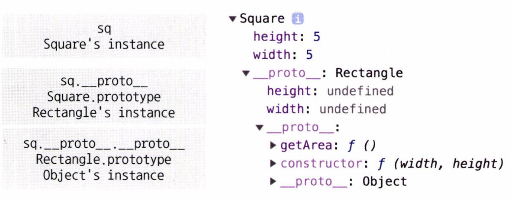
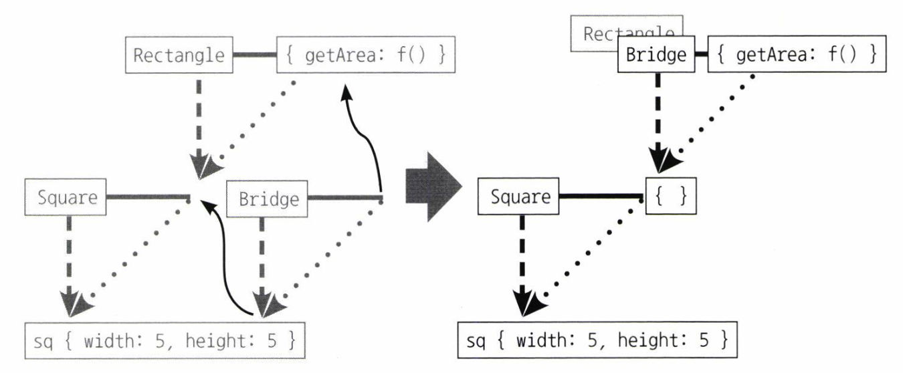

# Chapter 7. 클래스

## 클래스와 인스턴스의 개념 이해

### 일반적인 객체 지향 프로그래밍 에서의 ‘클래스’ 의미


- superclass - 상위 클래스
- subclass - 하위 클래스
- 상위 클래스의 특성은 하위 클래스에도 상속이 됨. 더 구체적인 요건이 추가 또는 변경됨
- 인스턴스 : 어떤 클래스의 속성을 지니는 실존하는 개체
    - 어떤 조건(클래스)에 부합하는 구체적인 예시
- 클래스 : 어떠한 집단에 속할 수 있는 조건. 추상적인 개념
- 클래스와 인스턴스는 모두 ‘직계존속’
    - 클래스가 먼저 정의돼야만 그로부터 공통적인 요소를 지니는 개체들을 생성할 수 있음

## 자바스크립트의 클래스

- 자바스크립트는 프로토타입 기반 언어이므로 클래스의 개념은 원래 존재하지 않음
    - 그러나, 프로토타입을 일반적인 의미에서의 클래스 관점에서 접근이 가능함
    - 인스턴스에 상속되는지(인스턴스가 참조하는지) 여부에 따라 스태틱 멤버와 인스턴스 멤버로 나뉨
- 일반적인 클래스 기반 언어에서 ‘인스턴스 메서드’라는 명칭을 사용하나, 자바스크립트에서는 ‘**프로토타입 메서드**’ 라고 칭하기로 함.
    
    
    

```jsx
var Rectangle = function(width, height) {
  this.width = width;
  this.height = height;
};
Rectangle.prototype.getArea = function() { // 프로토타입 메서드
  return this.width * this.height;
};
Rectangle.isRectangle = function(instance) { // 스태틱 메서드
  return (
    instance instanceof Rectangle && instance.width > 0 && instance.height > 0
  );
};

var rect1 = new Rectangle(3, 4); // 인스턴스
console.log(rect1.getArea()); // 12 (O)
console.log(rect1.isRectangle(rect1)); // Error (X)
console.log(Rectangle.isRectangle(rect1)); // true
```

- 위 상황에서 rect1은 getArea()를 직접 호출할 수 있음 (__proto__의 생략을 통해)
    - Rectangle.prototype.getArea와 같이 (프로토타입) 메서드를 정의하였기 때문
    - 인스턴스에서 직접 호출할 수 있는 메서드 ⇒ 프로토타입 메서드
- 위 상황에서 rect1은 isRectangle을 직접 호출할 수 없음
    - Rectangle.isRectangle로 메서드를 정의. 생성자 본인만 접근이 가능함.
    - 인스턴스에서 직접 접근할 수 없는 메서드 ⇒ 스태틱 메서드
    - this를 생성자 본인으로 해야만 호출할 수 있음

## 클래스 상속

### 기본 구현

- 프로토타입 체인을 활용하여 클래스 상속을 구현하고 객체지향 언어에서의 클래스와 비슷한 형태로 발전시킬 수 있음.

```jsx
var Grade = function() {
  var args = Array.prototype.slice.call(arguments);
  for (var i = 0; i < args.length; i++) {
    this[i] = args[i];
  }
  this.length = args.length;
};
Grade.prototype = [];
var g = new Grade(100, 80);

g.push(90);
console.log(g); // Grade { 0: 100, 1: 80, 2: 90, length: 3 }

delete g.length;
g.push(70);
console.log(g); // Grade { 0: 70, 1: 80, 2: 90, length: 1 }
```

- 자바스크립트에서 클래스 상속을 구현했다는 것 → 프로토타입 체이닝을 잘 연결한 것
    - 그러나 일반적인 클래스의 개념과 다르게, 클래스에 있는 값이 인스턴스의 동작에 영향을 주는 경우가 존재함.
    - 위 코드에서는 length 프로퍼티가 삭제가 가능하며, Grade.prototype에 빈 배열을 참조시킬 수 있음
        - 의도하는 바대로 동작하지 않음 ⇒ 코드 마지막줄 참고
        - g.__proto__가 빈 배열을 가리키고 있기 때문에 위와 같이 동작하게 됨.

```jsx
var Grade = function() {
  var args = Array.prototype.slice.call(arguments);
  for (var i = 0; i < args.length; i++) {
    this[i] = args[i];
  }
  this.length = args.length;
};
Grade.prototype = ['a', 'b', 'c', 'd'];// Grade.prototype에 요소를 포함하는 배열을 매칭
var g = new Grade(100, 80);

g.push(90);
console.log(g); // Grade { 0: 100, 1: 80, 2: 90, length: 3 }

delete g.length;
g.push(70);
console.log(g); // Grade { 0: 100, 1: 80, 2: 90, ___ 4: 70, length: 5 }
```

- 위와 같이 Grede.prototype에 요소를 포함하는 배열을 매칭시킨다면?
    - g.length를 호출하니, g.__proto__.length를 찾게되는 식으로 동작
- 이와 같이 자바스크립트에서 클래스를 사용하는것은 오류가 발생할 가능성을 안고 가야한다는 것을 의미함

### 상속 구현

```jsx
var Rectangle = function(width, height) {
  this.width = width;
  this.height = height;
};
Rectangle.prototype.getArea = function() {
  return this.width * this.height;
};
var rect = new Rectangle(3, 4);
console.log(rect.getArea()); // 12

var Square = function(width) {
  this.width = width;
};
Square.prototype.getArea = function() {
  return this.width * this.width;
};
var sq = new Square(5);
console.log(sq.getArea()); // 25
```

- 위 코드에서 Rectangle과 Square는 ‘width를 공통으로 사용.
- 하단과 같이 상속을 표현해 볼 수 있음

```jsx
var Rectangle = function(width, height) {
  this.width = width;
  this.height = height;
};
Rectangle.prototype.getArea = function() {
  return this.width * this.height;
};
var rect = new Rectangle(3, 4);
console.log(rect.getArea()); // 12

var Square = function(width) {
  Rectangle.call(this, width, width);
};
Square.prototype = new Rectangle();

var sq = new Square(5);
console.log(sq.getArea()); // 25
```

sq의 구조를 확인하면, 



- Square.prototype에 값이 존재함
- constructor가 여전히 Rectangle을 바라보고 있음
    - sq.constructor → sq.__proto__.__proto__ → Rectangle을 가리킴
    - 값을 지니게 됨

### 클래스가 구체적인 데이터를 지니지 않게 하는 방법

- 만들고 나서 프로퍼티들을 일일이 지우고 더는 새로운 프로퍼티를 추가할 수 없게 하는 방법이 있음.
1. 인스턴스 생성 후 프로퍼티 제거 - 함수 생성

```jsx
var extendClass1 = function(SuperClass, SubClass, subMethods) {
  SubClass.prototype = new SuperClass();
  for (var prop in SubClass.prototype) {
    if (SubClass.prototype.hasOwnProperty(prop)) {
      delete SubClass.prototype[prop];
    }
  }
  if (subMethods) {
    for (var method in subMethods) {
      SubClass.prototype[method] = subMethods[method];
    }
  }
  Object.freeze(SubClass.prototype);
  return SubClass;
};

var Rectangle = function(width, height) {
  this.width = width;
  this.height = height;
};
Rectangle.prototype.getArea = function() {
  return this.width * this.height;
};
var Square = extendClass1(Rectangle, function(width) {
  Rectangle.call(this, width, width);
});
var sq = new Square(5);
console.log(sq.getArea()); // 25
```

1. 빈 함수를 활용하여 구현하는 방식
- SubClass의 prototype에 직접 SuperClass의 인스턴스를 할당하는 대신 아무런 프로퍼티를 생성하지 않는 빈 생성자 함수(Bridge)를 하나 더 만들어서 빈 함수에 다리 역할을 부여하는 것

 

```jsx
var extendClass2 = (function() {
  var Bridge = function() {}; // 클로저로 활용
  return function(SuperClass, SubClass, subMethods) {
    Bridge.prototype = SuperClass.prototype;
    SubClass.prototype = new Bridge();
    if (subMethods) {
      for (var method in subMethods) {
        SubClass.prototype[method] = subMethods[method];
      }
    }
    Object.freeze(SubClass.prototype);
    return SubClass;
  };
})();

var Rectangle = function(width, height) {
  this.width = width;
  this.height = height;
};
Rectangle.prototype.getArea = function() {
  return this.width * this.height;
};
var Square = extendClass2(Rectangle, function(width) {
  Rectangle.call(this, width, width);
});
var sq = new Square(5);
console.log(sq.getArea()); // 25
```



- Bridge라는 빈 함수 생성
- Bridge.prototype이 Rectangle.prototype을 참조하게 함

1. Object.create를 활용하는 방법

```jsx
var Rectangle = function(width, height) {
  this.width = width;
  this.height = height;
};
Rectangle.prototype.getArea = function() {
  return this.width * this.height;
};
var Square = function(width) {
  Rectangle.call(this, width, width);
};
////구현 방식////
Square.prototype = Object.create(Rectangle.prototype);
Object.freeze(Square.prototype);
////구현방식////

var sq = new Square(5);
console.log(sq.getArea()); // 25
```

- ES5에서 도입됨
- 앞서 두 방법보다 간단하고 안전함

⇒ 결론 : SubClass.prototype의 __proto__가 SuperClass.prototype을 참조하고, 이에 불필요한 인스턴스 프로퍼티가 남아있지 않다면 됨.

### constructor 복구하기

- 위 방법들은 상속은 성공적이나, 인스턴스의 constructor는 SuperClass를 가리키고 있음.
- SubClass.prototype.constructor가 원래의 SubClass를 바라보도록 해줘야함.
1. 인스턴스 생성 후 프로퍼티 제거

```jsx
var extendClass2 = (function() {
  var Bridge = function() {};
  return function(SuperClass, SubClass, subMethods) {
    Bridge.prototype = SuperClass.prototype;
    SubClass.prototype = new Bridge();
    SubClass.prototype.consturctor = SubClass;
    Bridge.prototype.constructor = SuperClass;
    if (subMethods) {
      for (var method in subMethods) {
        SubClass.prototype[method] = subMethods[method];
      }
    }
    Object.freeze(SubClass.prototype);
    return SubClass;
  };
})();
```

1. 빈 함수를 활용

```jsx
var extendClass2 = (function() {
  var Bridge = function() {};
  return function(SuperClass, SubClass, subMethods) {
    Bridge.prototype = SuperClass.prototype;
    SubClass.prototype = new Bridge();
    SubClass.prototype.consturctor = SubClass;
    Bridge.prototype.constructor = SuperClass;
    if (subMethods) {
      for (var method in subMethods) {
        SubClass.prototype[method] = subMethods[method];
      }
    }
    Object.freeze(SubClass.prototype);
    return SubClass;
  };
})();
```

1. Object.create 활용

```jsx
var extendClass3 = function(SuperClass, SubClass, subMethods) {
  SubClass.prototype = Object.create(SuperClass.prototype);
  SubClass.prototype.constructor = SubClass;
  if (subMethods) {
    for (var method in subMethods) {
      SubClass.prototype[method] = subMethods[method];
    }
  }
  Object.freeze(SubClass.prototype);
  return SubClass;
};
```

? 코드 설명 없음?

### 상위 클래스에의 접근 수단 제공

- 매번 SuperClass.prototype을 관리하기 번거로움.
- super를 흉내내는 방법

```jsx
var extendClass = function(SuperClass, SubClass, subMethods) {
  SubClass.prototype = Object.create(SuperClass.prototype);
  SubClass.prototype.constructor = SubClass;
  SubClass.prototype.super = function(propName) {
    // 추가된 부분 시작
    var self = this;
    if (!propName)
      return function() {
        SuperClass.apply(self, arguments);
      };
    var prop = SuperClass.prototype[propName];
    if (typeof prop !== 'function') return prop; // 클로저 활용
    return function() { 
      return prop.apply(self, arguments);
    };
  }; // 추가된 부분 끝
  if (subMethods) {
    for (var method in subMethods) {
      SubClass.prototype[method] = subMethods[method];
    }
  }
  Object.freeze(SubClass.prototype);
  return SubClass;
};

var Rectangle = function(width, height) {
  this.width = width;
  this.height = height;
};
Rectangle.prototype.getArea = function() {
  return this.width * this.height;
};
var Square = extendClass(
  Rectangle,
  function(width) {
    this.super()(width, width); // super 사용 (1)
  },
  {
    getArea: function() {
      console.log('size is :', this.super('getArea')()); // super 사용 (2)
    },
  }
);
var sq = new Square(10);
sq.getArea(); // size is : 100
console.log(sq.super('getArea')()); // 100
```

### ES6의 클래스 및 클래스 상속

- ES6에서는 클래스 문법을 지원

```jsx
var ES5 = function(name) {
  this.name = name;
};
ES5.staticMethod = function() {
  return this.name + ' staticMethod';
};
ES5.prototype.method = function() {
  return this.name + ' method';
};
var es5Instance = new ES5('es5');
console.log(ES5.staticMethod()); // es5 staticMethod
console.log(es5Instance.method()); // es5 method

var ES6 = class { // 클래스 본문 시작
  constructor(name) { // 매서드
    this.name = name;
  }
  static staticMethod() { 
    return this.name + ' staticMethod';
  }
  method() { // 자동으로 prototype 객체 내부에 할당되는 메서드
    return this.name + ' method';
  }
};
var es6Instance = new ES6('es6');
console.log(ES6.staticMethod()); // es6 staticMethod
console.log(es6Instance.method()); // es6 method
```

```jsx
var Rectangle = class {
  constructor(width, height) {
    this.width = width;
    this.height = height;
  }
  getArea() {
    return this.width * this.height;
  }
};
var Square = class extends Rectangle { // 클래스 상속 지원
  constructor(width) {
    super(width, width); // SuperClass의 constructor를 수행하게 됨.
  }
  getArea() {
    console.log('size is :', super.getArea()); // super는 SuperClass.prototype을 바라봄
  }
};
```

## 정리

1. 자바스크립트에서 상속 개념은 존재하지 않지만, 프로토타입을 기반으로 클래스와 비슷하게 동작하게끔 하는 기법들이 도입되어 옴
2. 클래스의 prototype 내부에 정의된 메서드를 프로토타입 메서드라고 함.
    1. 인스턴스가 마치 자신의 것처럼 호출할 수 있음
3. 클래스(생성자 함수)에 직접 정의한 메서드를 스태틱 메서드라고 함.
    1. 인스턴스가 직접 호출할 수 없고 클래스(생성자 함수)에 의해서만 호출할 수 있음
4. 클래스 상속을 흉내내는 방법
    1. Subclass.prototype에 SuperClass의 인스턴스를 할당한 다음 프로퍼티를 모두삭제하는 방법
    2. 빈 함수를 활용하는 방법
    3. Object.create를 이용하는 방법
    
    ⇒ constructor 프로퍼티가 원래의 생성자 함수를 보게끔 조정해야 함.
    
5. ES6에서는 공식 지원 중
