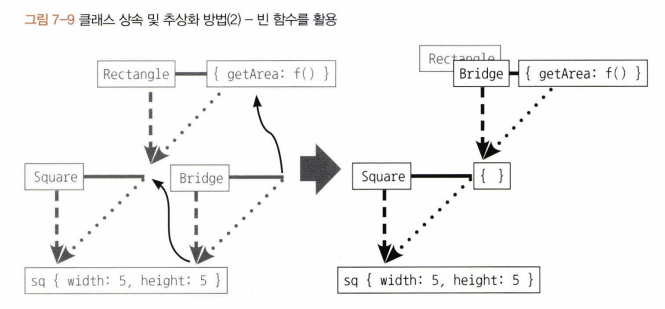

# 7장

## 7.1 클래스와 인스턴스의 개념 이해

클래스 : 공통 요소를 지니는 집단을 분류하기 위한 개념  
인스턴스 : 어떤 클래스의 속성을 지니는 실존하는 개체

현실 세계에서는 이미 존재하는 개체를 성질에 따라 분류해서 다양한 클래스를 생성  
프로그래밍에서는 클래스를 먼저 정의하고 개체를 생성

## 7-2 자바스크립트의 클래스

```js
var Rectangle = function (width, height) {
  // 생성자
  this.width = width;
  this.height = height;
};
Rectangle.prototype.getArea = function () {
  // 인스턴스에서 사용 가능
  // 프로토타입 메서드
  return this.width * this.height;
};
Rectangle.isRectangle = function (instance) {
  // 스태틱 메서드
  return (
    instance instanceof Rectangle && instance.width > 0 && instance.height > 0
  );
};

var rect1 = new Rectangle(3, 4);
console.log(rect1.getArea()); // 12 (O)
console.log(rect1.isRectangle(rect1)); // Error (X)
console.log(Rectangle.isRectangle(rect1)); // true
```

클래스 자체를 this로 해서 직접 접근해야 하는 스태틱 메서드를 호출할 때의 클래스는 그 자체가 하나의 개체로서 취급된다.

## 7-3 클래스 상속

ES5에서는 이런식으로 사용했다  
prototype 기반 -> 프로토타입 체이닝을 잘 연결했다.

```js
var Grade = function () {
  var args = Array.prototype.slice.call(arguments);
  for (var i = 0; i < args.length; i++) {
    this[i] = args[i];
  }
  this.length = args.length;
};
Grade.prototype = [];
var g = new Grade(100, 80);

g.push(90);
console.log(g); // Grade { 0: 100, 1: 80, 2: 90, length: 3 }
```

```js
delete g.length;
g.push(70);
console.log(g); // Grade { 0: 70, 1: 80, 2: 90, length: 1 }
// 빈배열 length가 1
```

Grade 클래스의 인스턴스는 배열 메서드를 상속하지만 기본적으로는 일반 객체의 성질을 그대로 지니므로 삭제가 가능해서 문제가 됨

```js
var Grade = function () {
  var args = Array.prototype.slice.call(arguments);
  for (var i = 0; i < args.length; i++) {
    this[i] = args[i];
  }
  this.length = args.length;
};
Grade.prototype = ["a", "b", "c", "d"];
var g = new Grade(100, 80);

g.push(90);
console.log(g); // Grade { 0: 100, 1: 80, 2: 90, length: 3 }

delete g.length;
g.push(70);
console.log(g); // Grade { 0: 100, 1: 80, 2: 90, ___ 4: 70, length: 5 }
```

클래스에 있는 값이 인스턴스의 동작에 영향을 줘선 안된다.

### 7-3-2 클래스가 구체적인 데이터를 지니지 않게 하는 방법

```js
var extendClass1 = function (SuperClass, SubClass, subMethods) {
  SubClass.prototype = new SuperClass();
  for (var prop in SubClass.prototype) {
    if (SubClass.prototype.hasOwnProperty(prop)) {
      delete SubClass.prototype[prop];
    }
  }
  if (subMethods) {
    for (var method in subMethods) {
      SubClass.prototype[method] = subMethods[method];
    }
  }
  Object.freeze(SubClass.prototype);
  return SubClass;
};

var Rectangle = function (width, height) {
  this.width = width;
  this.height = height;
};
Rectangle.prototype.getArea = function () {
  return this.width * this.height;
};
var Square = extendClass1(Rectangle, function (width) {
  Rectangle.call(this, width, width);
});
var sq = new Square(5);
console.log(sq.getArea()); // 25
```

프로퍼티들을 일일이 지우고 새로운 프로퍼티를 추가할 수 없게 하는 것

```js
var extendClass2 = (function () {
  var Bridge = function () {};
  return function (SuperClass, SubClass, subMethods) {
    Bridge.prototype = SuperClass.prototype;
    SubClass.prototype = new Bridge();
    if (subMethods) {
      for (var method in subMethods) {
        SubClass.prototype[method] = subMethods[method];
      }
    }
    Object.freeze(SubClass.prototype);
    return SubClass;
  };
})();

var Rectangle = function (width, height) {
  this.width = width;
  this.height = height;
};
Rectangle.prototype.getArea = function () {
  return this.width * this.height;
};
var Square = extendClass2(Rectangle, function (width) {
  Rectangle.call(this, width, width);
});
var sq = new Square(5);
console.log(sq.getArea()); // 25
```

인스턴스를 제외한 프로토타입 체인 경로상에는 더는 구체적인 데이터가 남지 않음


```js
var Rectangle = function (width, height) {
  this.width = width;
  this.height = height;
};
Rectangle.prototype.getArea = function () {
  return this.width * this.height;
};
var Square = function (width) {
  Rectangle.call(this, width, width);
};
Square.prototype = Object.create(Rectangle.prototype);
Object.freeze(Square.prototype);

var sq = new Square(5);
console.log(sq.getArea()); // 25
```

Object.create

### 7-3-3 constructor 복구하기

위 세가지 방법 모두 기본적인 상속에는 성공했지만 SubClass 인스턴스의 constructor는 여전히 SuperClass를 가리키는 상태  
Subclass 인스턴스에는 constrrctor가 없고, Subclass.prototype에도 없음

```js
SubClass.prototype.constructor = SubClass;
```

## 7-4 ES6의 클래스 및 클래스 상속

```js
var ES5 = function (name) {
  this.name = name;
};
ES5.staticMethod = function () {
  return this.name + " staticMethod";
};
ES5.prototype.method = function () {
  return this.name + " method";
};
var es5Instance = new ES5("es5");
console.log(ES5.staticMethod()); // es5 staticMethod
console.log(es5Instance.method()); // es5 method

var ES6 = class {
  constructor(name) {
    this.name = name;
  }
  static staticMethod() {
    return this.name + " staticMethod";
  }
  method() {
    return this.name + " method";
  }
};
var es6Instance = new ES6("es6");
console.log(ES6.staticMethod()); // es6 staticMethod
console.log(es6Instance.method()); // es6 method
```
