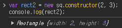

# 코어 자바스크립트

자바스크립트의 핵심 개념을 정확히 이해하기

[예제코드](https://github.com/wikibook/corejs)

## 클래스와 인스턴스의 개념 이해

자바스크립트는 프로토타입 기반 언어라 '상속' 개념이 존재하지 않는다. ES6에는 클래스 문법이 추가되었지만 여전히 일정 부분은 프로토타입을 활용하기 때문에, ES5 체제 하에서 클래스를 흉내내기 위한 구현 방식을 학습하는 건 여전히 큰 의미가 있다.

클래스는 집단이다.


직관적으로 상위 클래스와 하위 클래스 개념을 생각할 수 있다.


하위 개념은 상위 개념을 포함하면서 속성이 추가된다.

클래스는 공통 속성을 정의하는 개념이고 클래스의 속성을 지니는 개체를 인스턴스라고 한다. 인스턴스는 사례라는 뜻인데, (클래스의 공통 속성 조건에 부합하는) '사례'로 해석할 수 있다.

## 자바스크립트의 클래스

프로토타입 체이닝의 메커니즘으로 상속을 흉내낼 수 있다.

let arr = new Array() 에서 arr은 인스턴스이고, Array.prototype 객체 내부 요소가 arr 에 상속된다고 볼 수 있다.

prototype 을 제외한 나머지는 인스턴스에 상속되지 않는다.

인스턴스 상속 여부에 따라 static member 와 instance member 로 나누는데, 다른 언어의 클래스 구성요소에 대한 정의를 차용한 것이다. 그런데 JS에서는 인스턴스도 메서드를 정의할 수 있다. 그러므로 instance method 라고 부르지 말고 prototype method 라고 부르는 것이 낫다. (세계적 트렌드)


위와 같이 프로토타입 체이닝에 클래스 개념을 적용할 수 있다.

```js
var Rectangle = function(width, height) { // 생성자
  this.width = width;
  this.height = height;
};
Rectangle.prototype.getArea = function() { // 프로토타입 메서드
  return this.width * this.height;
};
Rectangle.isRectangle = function(instance) { // 스태틱 메서드
  return (
    instance instanceof Rectangle && instance.width > 0 && instance.height > 0
  );
};

var rect1 = new Rectangle(3, 4);
console.log(rect1.getArea()); // 12 (O)
console.log(rect1.isRectangle(rect1)); // Error (X)
console.log(Rectangle.isRectangle(rect1)); // true
```

인스턴스는 스태틱 메서드를 호출할 수 없다.

클래스가 항상 추상적 개념인 것은 아니다. 객체일 수도 있는데, 인스턴스가 사용할 메서드를 정의한 틀의 역할을 할 때는 개념이고, 클래스 자체를 this로 접근하는 스태틱 메서드를 호출할 때는 객체로 취급한다.

## 클래스 상속

### 기본 구현

최대한 전통적인 객체지향 언어에서의 클래스와 비슷한 형태로까지 발전시켜 보는 것을 목표한다.


```js
var Grade = function() {
  var args = Array.prototype.slice.call(arguments);
  for (var i = 0; i < args.length; i++) {
    this[i] = args[i];
  }
  this.length = args.length;
};
Grade.prototype = [];
var g = new Grade(100, 80);
```

위 코드는 문제가 있다. length 프로퍼티가 configurable 한 점과, Grade.prototype에 빈 배열을 참조시켰다.

g에서 length 프로퍼티를 삭제하면 g.push 대신 클래스인 Grade의 __proto__.length 의 값을 바꿔 버리고, 클래스의 값이 다시 인스턴스에 영향을 주어서 추상성을 해친다.


```js
var Rectangle = function(width, height) {
  this.width = width;
  this.height = height;
};
Rectangle.prototype.getArea = function() {
  return this.width * this.height;
};
var rect = new Rectangle(3, 4);
console.log(rect.getArea()); // 12

var Square = function(width) {
  Rectangle.call(this, width, width);
};
Square.prototype = new Rectangle();

var sq = new Square(5);
console.log(sq.getArea()); // 25
```

정사각형이 직사각형을 상속하는 예시이다. 

마찬가지로, Square.prototype에 구체적인 값이 존재한다. sq.width를 지워버린다면 Square.prototype의 값을 인스턴스에서 참조할 것이므로 문제가 된다. 

또한 Square 자기 자신을 가리키는 constructor 프로퍼티는 prototype에 존재하는데, prototype을 Rectangle 로 바꿔버렸으니 sq.constructor가 Rectangle이 되어버리는 대참사가 발생한다.



### 클래스가 구체적인 데이터를 지니지 않게 하는 방법

일단 만들고 나서 프로퍼티를 모두 지우고, 새 프로퍼티를 추가할 수 없게 하면 된다.

```js
var extendClass1 = function(SuperClass, SubClass, subMethods) {
  SubClass.prototype = new SuperClass();
  for (var prop in SubClass.prototype) {
    if (SubClass.prototype.hasOwnProperty(prop)) {
      delete SubClass.prototype[prop];
    }
  }
  if (subMethods) {
    for (var method in subMethods) {
      SubClass.prototype[method] = subMethods[method];
    }
  }
  Object.freeze(SubClass.prototype);
  return SubClass;
};

var Rectangle = function(width, height) {
  this.width = width;
  this.height = height;
};
Rectangle.prototype.getArea = function() {
  return this.width * this.height;
};
var Square = extendClass1(Rectangle, function(width) {
  Rectangle.call(this, width, width);
});
var sq = new Square(5);
console.log(sq.getArea()); // 25
```

또다른 방안이 있는데, 더글라스 크락포드가 제시해서 대중적으로 널리 알려진 방안이다.

```js
var extendClass2 = (function() {
  var Bridge = function() {};
  return function(SuperClass, SubClass, subMethods) {
    Bridge.prototype = SuperClass.prototype;
    SubClass.prototype = new Bridge();
    if (subMethods) {
      for (var method in subMethods) {
        SubClass.prototype[method] = subMethods[method];
      }
    }
    Object.freeze(SubClass.prototype);
    return SubClass;
  };
})();

var Rectangle = function(width, height) {
  this.width = width;
  this.height = height;
};
Rectangle.prototype.getArea = function() {
  return this.width * this.height;
};
var Square = extendClass2(Rectangle, function(width) {
  Rectangle.call(this, width, width);
});
var sq = new Square(5);
console.log(sq.getArea()); // 25
```

자식의 prototype에 직접 부모의 인스턴스를 할당하는 대신, 빈 생성자 함수를 할당하는 방식이다. 빈 생성자 함수 Bridge 의 prototype 을 부모의 prototype으로 만들고 자식의 prototype에 Bridge 의 인스턴스를 할당하는 것이다.


프로토타입 체인에서 부모의 인스턴스(Rectangle의 인스턴스)가 제거되었으므로, 구체적인 값이 존재하지 않게 된다.


이제 sq.width를 삭제하면, undefined가 나온다. 왜? sq.__proto__는 이제 인스턴스가 아니라 함수니까...

```js
var Rectangle = function(width, height) {
  this.width = width;
  this.height = height;
};
Rectangle.prototype.getArea = function() {
  return this.width * this.height;
};
var Square = function(width) {
  Rectangle.call(this, width, width);
};
Square.prototype = Object.create(Rectangle.prototype);
Object.freeze(Square.prototype);

var sq = new Square(5);
console.log(sq.getArea()); // 25
```
세 번째로 Object.create 를 이용하는 방법도 있다.

```js
Object.create(proto[, propertiesObject])
```

브릿지 함수의 인스턴스를 더 간단하게 만들 수 있다.


### constructor 복구하기

위에서 상속은 되었지만, 자식의 인스턴스의 constructor가 여전히 부모를 가리킨다. 자식의 prototype의 constructor를 자식 자기 자신으로 바꿔주면 된다.

```js
var extendClass3 = function(SuperClass, SubClass, subMethods) {
  SubClass.prototype = Object.create(SuperClass.prototype);
  SubClass.prototype.constructor = SubClass;
  if (subMethods) {
    for (var method in subMethods) {
      SubClass.prototype[method] = subMethods[method];
    }
  }
  Object.freeze(SubClass.prototype);
  return SubClass;
};
```

### 상위 클래스에의 접근 수단 제공

상위 클래스 메서드를 호출하고 싶을 수 있다.

```js
SuperClass.prototype.method.apply(this, arguments)
```

이건 너무 가독성이 떨어진다. super 를 흉내내보자.

```js
var extendClass = function(SuperClass, SubClass, subMethods) {
  SubClass.prototype = Object.create(SuperClass.prototype);
  SubClass.prototype.constructor = SubClass;
  SubClass.prototype.super = function(propName) {
    // 추가된 부분 시작
    var self = this;
    if (!propName)
      return function() {
        SuperClass.apply(self, arguments);
      };
    var prop = SuperClass.prototype[propName];
    if (typeof prop !== 'function') return prop;
    return function() {
      return prop.apply(self, arguments);
    };
  }; // 추가된 부분 끝
  if (subMethods) {
    for (var method in subMethods) {
      SubClass.prototype[method] = subMethods[method];
    }
  }
  Object.freeze(SubClass.prototype);
  return SubClass;
};

var Rectangle = function(width, height) {
  this.width = width;
  this.height = height;
};
Rectangle.prototype.getArea = function() {
  return this.width * this.height;
};
var Square = extendClass(
  Rectangle,
  function(width) {
    this.super()(width, width); // super 사용 (1)
  },
  {
    getArea: function() {
      console.log('size is :', this.super('getArea')()); // super 사용 (2)
    },
  }
);
var sq = new Square(10);
sq.getArea(); // size is : 100
console.log(sq.super('getArea')()); // 100
```

## ES6의 클래스 및 클래스 상속

근데 이거 다 ES6에서 클래스 문법으로 제공한다.

```js
var ES5 = function(name) {
  this.name = name;
};
ES5.staticMethod = function() {
  return this.name + ' staticMethod';
};
ES5.prototype.method = function() {
  return this.name + ' method';
};
var es5Instance = new ES5('es5');
console.log(ES5.staticMethod()); // es5 staticMethod
console.log(es5Instance.method()); // es5 method

var ES6 = class {
  constructor(name) { // 클래스 본문에서는 function을 생략해도 메서드로 인식한다
    this.name = name;
  } // 메서드 간에는 콤마로 구분하지 않는다
  static staticMethod() { // static 메서드 정의
    return this.name + ' staticMethod';
  }
  method() { // 프로토타입 메서드
    return this.name + ' method';
  }
};
var es6Instance = new ES6('es6');
console.log(ES6.staticMethod()); // es6 staticMethod
console.log(es6Instance.method()); // es6 method
```

```js
var Rectangle = class {
  constructor(width, height) {
    this.width = width;
    this.height = height;
  }
  getArea() {
    return this.width * this.height;
  }
};
var Square = class extends Rectangle {
  constructor(width) {
    super(width, width);
  }
  getArea() {
    console.log('size is :', super.getArea());
  }
};
```
클래스의 상속도 간단하고 super 도 그냥 있다