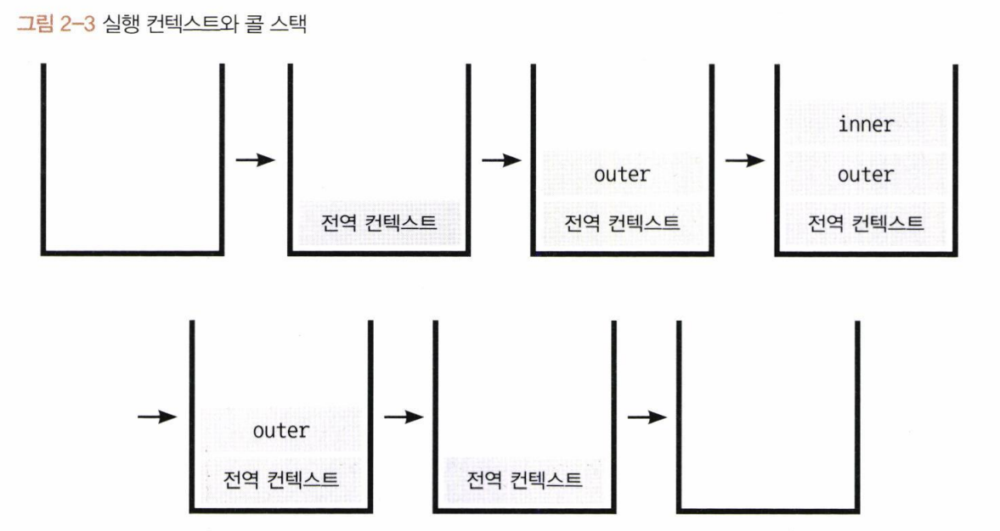
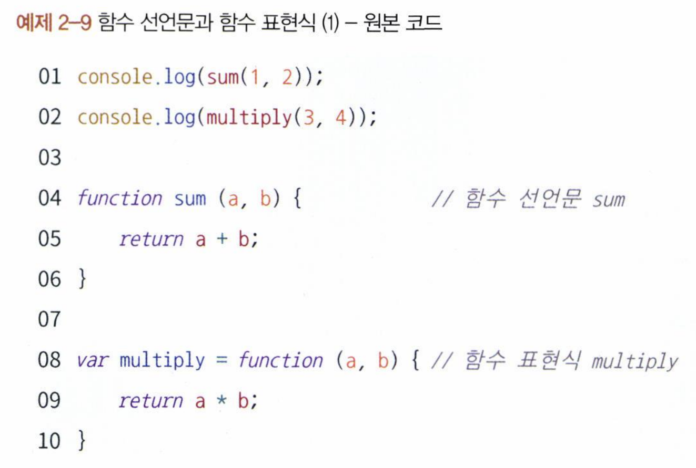
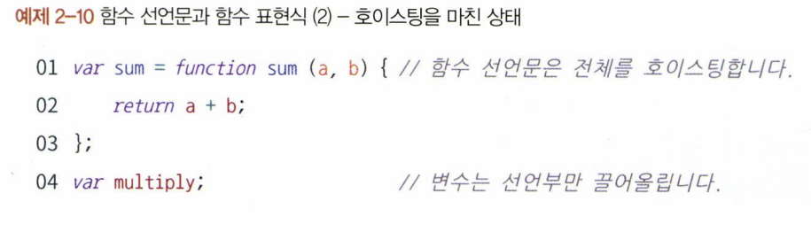
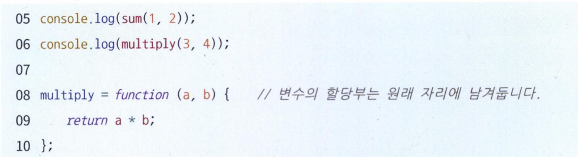
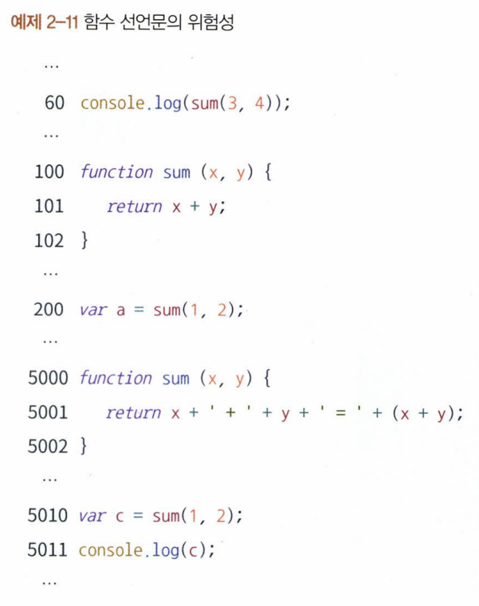
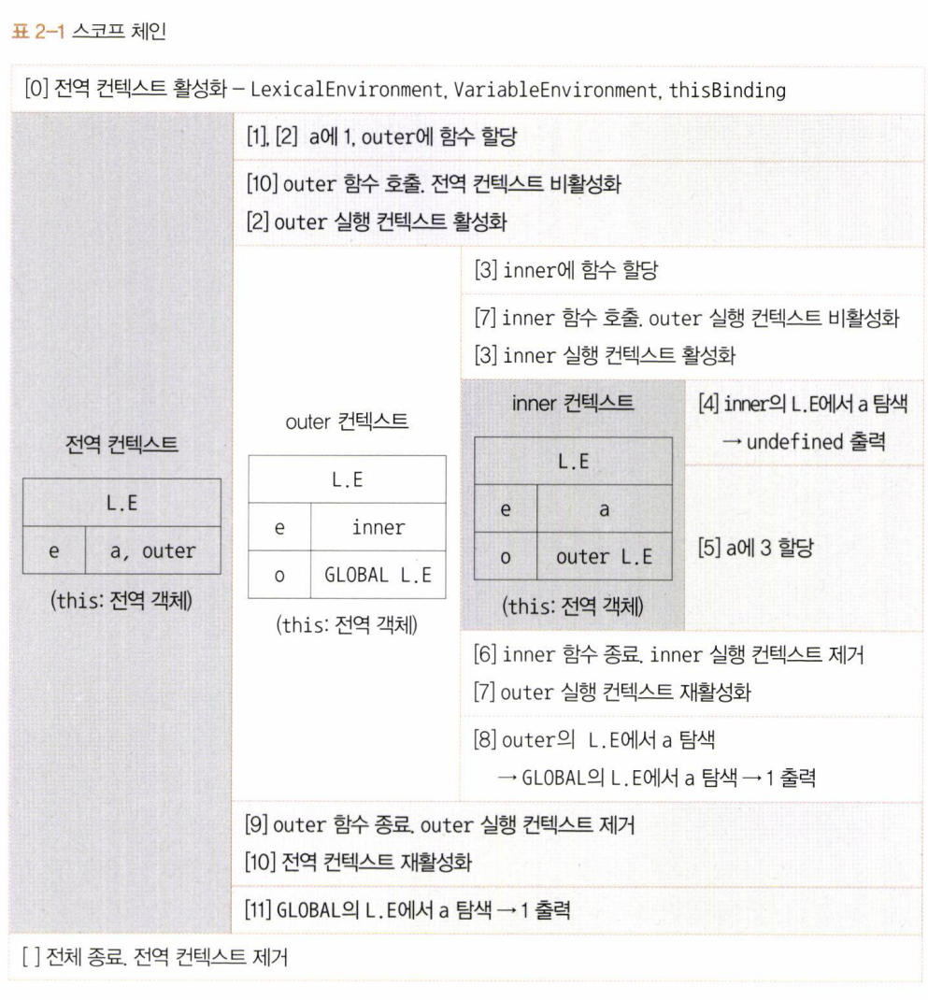

# 2장 실행 컨텍스트

## 2-1 실행 컨텍스트란?

- 실행 컨텍스트 : 실행할 코드에 제공할 환경 정보들을 모아놓은 객체

동일한 환경에 있는 코드들을 실행할 때 필요한 환경 정보들을 모아 컨텍스트를 구성하고 이를 콜 스택에 쌓아올렸다가 가장 위에 쌓여있는 컨텍스트와 관련 있는 코드들을 실행하는 식으로 전체 코드의 환경과 순서를 보장

하나의 실행 컨텍스트를 구성할 수 있는 방법

1. 자동으로 생성되는 전역 공간
2. eval
3. 함수를 실행

```javaScript
var a = 1;
function outer() {
	function inner() {
		console.log(a); //undefined
		var a = 3;
	}
	inner();
	console.log(a); // 1
}

outer();
console.log(a); // 1
```



한 실행 컨텍스트가 콜 스택의 맨위에 쌓이는 순간 = 현재 실행할 코드에 관여하게 되는 시점

=> 실행 컨텍스트가 활성화될 때 자바스크립트 엔진은 해당 컨텍스트에 관련된 코드들을 실행하는 데 필요한 환경 정보들을 수집해서 실행 컨텍스트 객체에 저장

실행 컨텍스트 객체에 저장되는 정보

- VaraiableEnvironment : 현재 컨특스트 내의 식별자들에 대한 정보 + 외부 환경 정보, 선언 시점의 LexicalEnvironment의 스냅샷으로, _변경 사항은 반영되지 않음_
- LexicalEnvironment: 처음에는 VariableEnvironment와 같지만 _변경 사항이 실시간으로 반영됨_
- ThisBinding: this 식별자가 바라봐야 할 대상 객체

## 2-2 VariableEnvironment

VariableEnvironment에 담기는 내용은 LexicalEnvironment와 같지만 최초 실행 시의 스냅샷을 유지함

LexicalEnvironment는 VariableEnvironment를 복사해서 만들고, 이후에는 LexicalEnvironment를 주로 활용함

## 2-3 LexicalEnvironment

#### 2-3-1 environmentRecord와 호이스팅

environmentRecord에는 현재 컨텍스트와 관련된 코드의 식별자 정보들이 저장됨

식별자

- 컨텍스트를 구성하는 함수에 지정된 **매개변수 식별자**
- 선언한 함수가 있을 경우 그 **함수 자체**
- var로 선언된 **변수의 식별자**

변수 정보를 수집하는 과정을 모두 마쳤더라도 아직 실행 컨텍스트가 관여할 코드들은 실행되기 전의 상태이다.

-> 호이스팅

> 매개변수와 변수에 대한 호이스팅(1) - 원본 코드

```js
function a(x) {
  console.log(x); // (1) 예상 : 1
  var x;
  console.log(x); // (2) 예상 : undefined
  var x = 2;
  console.log(x); // (3) 예상 : 2
}
```

> 매개변수와 변수에 대한 호이스팅(2) - 매개변수를 변수 선언/할당과 같다고 간주해서 변환한 상태

```js
function a() {
  var x = 1;
  console.log(x); // (1)
  var x;
  console.log(x); // (2)
  var x = 2;
  console.log(x); // (3)
}
```

→ **호이스팅 처리**!! (변수명만 끌어올리고 할당 과정은 원래 자리에 그래도 남겨둡니다)

> 매개변수와 변수에 대한 호이스팅(3) - 호이스팅을 마친 상태

```jsx
function a() {
  var x; // 변수 x 선언 → 메모리에서 저장 공간 확보, 주솟값을 변수 x에 연결
  var x; // 다시 변수 x 선언
  var x; // 무시

  x = 1; // x에 1을 할당 → 1을 별도의 메모리에 담고, 주솟값 입력
  console.log(x); // 1
  console.log(x); // 1
  x = 2; // x에 2를 할당 → 2을 별도의 메모리에 담고, 1을 가리키는 주솟값을 2를 가리키는 주소값으로 대치
  console.log(x); // 2
}

a(1);
```

- **변수**는 선언부와 할당부를 나누어 **선언부**만 끌어올림
- **함수** 선언(문)은 **함수 전체**를 끌어올림

함수를 새롭게 정의할 때 사용하는 방식

- **함수 선언문** : function 정의부만 존재하고 별도의 할당 명령이 없는 것 (반드시 **함수명** 정의)
- **함수 표현식** : 정의한 function을 별도의 변수에 할당하는 것
  - **기명 함수 표현식** : 함수명을 정의한 함수 표현식
  - **익명 함수 표현식** : 함수명을 정의하지 않은 표현식

```jsx
function a() {} // 함수 선언문
a(); // 실행 o

var b = function () {}; // (익명) 함수 표현식
b(); // // 실행 o

var c = function d() {}; // 기명 함수 표현식
c(); // 실행 o
d(); // error (함수명은 오직 내부에서만 접근 가능)
```





함수 선언문 : **전체**를 호이스팅 \
함수 표현식 : **변수 선언부**만 호이스팅


동일한 변수명에 서로 다른 값을 할당할 경우 나중에 할당한 값이 먼저 할당한 값을 덮어씌움

-> 맨 마지막에 선언된 함수가 실행됨, 함수 선언문의 위험성 (함수 표현식이라면 막을 수 있는 버그)

#### 2-3-2 스코프, 스코프 체인, outerEnvironmentReference

스코프 : 식별자에 대한 유효범위  
스코프 체인 : 식별자의 유효범위를 안에서부터 바깥으로 차례로 검색해나가는 것, outerEnvironmentReference가 가능케 함

outerEnvironmentReference는 현재 호출된 함수가 선언될 당시의 LexicalEnvironment를 참조한다.  
-> 여러 스코프에서 동일한 식별자를 선언한 경우에는 무조건 스코프 체인 상에서 가장 먼저 발견된 식별자에만 접근 가능 (변수 은닉화)

-> undeifned, 1, 1 순으로 출력


## 2-4 this

실행 컨텍스트의 thisBinding에는 this로 지정된 객체가 저장됨.  
실행 컨텍스트 활성화 당시에 this가 지정되지 않은 경우 this에는 전역 객체가 저장됨
